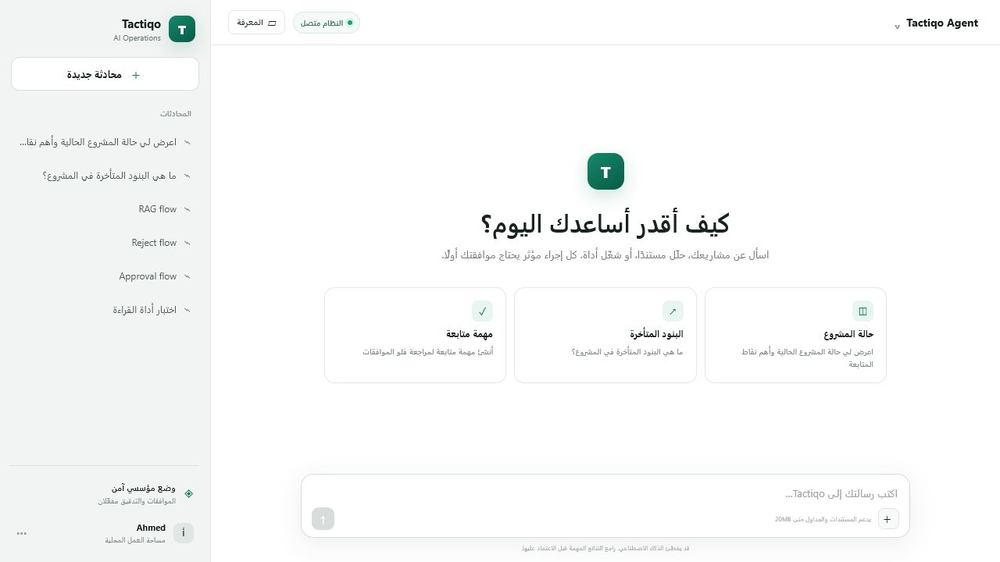
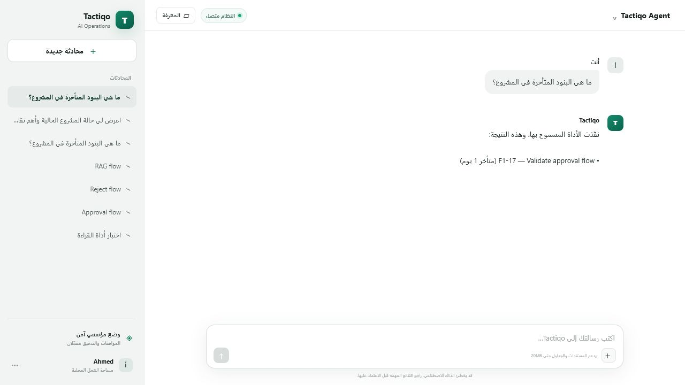
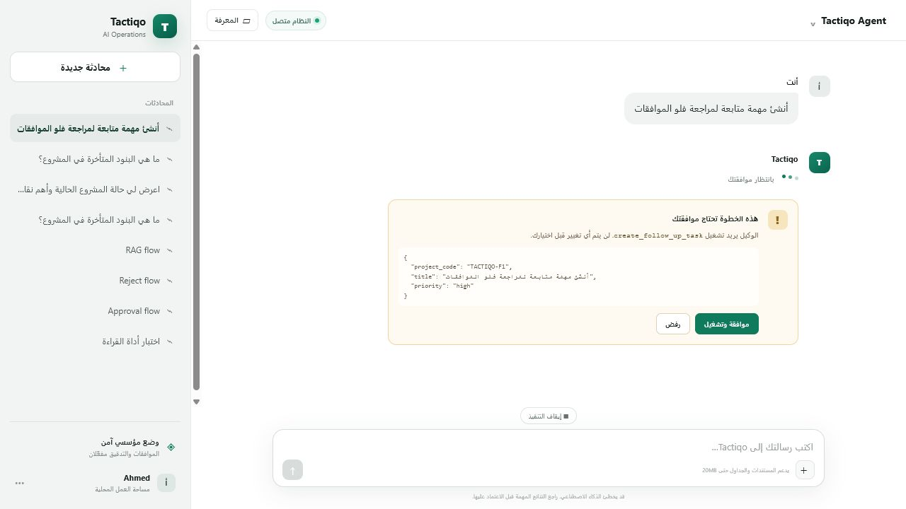
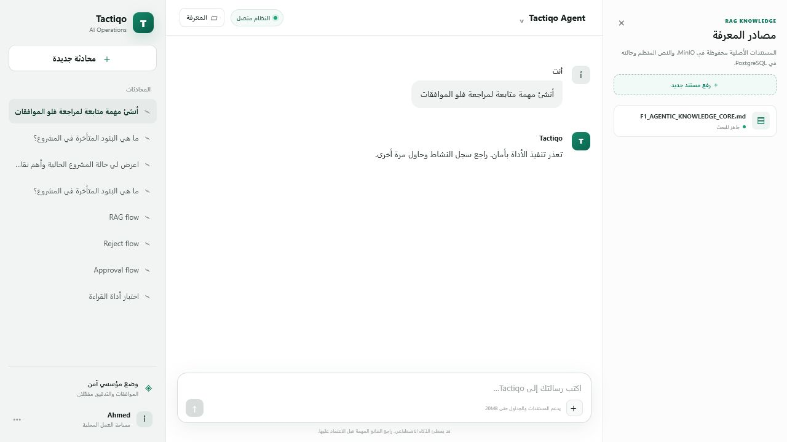
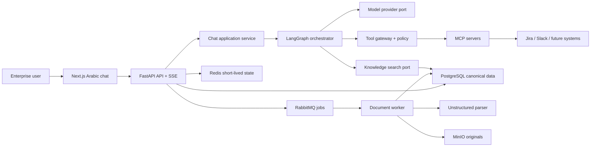
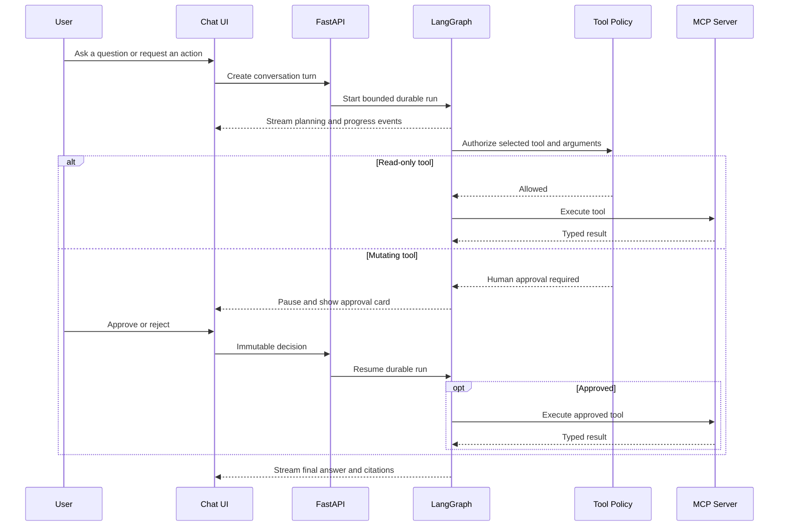
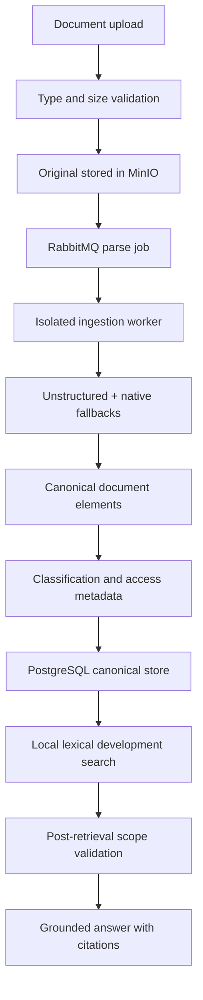

# Tactiqo AI Operations Platform

<p align="center">
  <strong>Governed, chat-first AI operations for enterprise delivery, knowledge, tools, and approvals.</strong>
</p>

<p align="center">
  
  
  
  
  
</p>

Tactiqo is a B2B AI operations platform for project, delivery, quality, risk,
and business-operations intelligence. Its first executable product increment
combines an Arabic-first conversational workspace, durable agent orchestration,
MCP tools, human approval for mutations, asynchronous document ingestion, and
citation-grounded retrieval.

> **Status:** Phase 0, F1, and F2 run locally end to end. F3's local LM Studio
> LLM/Embedding Bank and Owner settings playground are operational. Production identity,
> organization hierarchy, versioned authorization, scoped Agent Catalog packs,
> and guarded Planner invocation are implemented. External SaaS credentials,
> provider banks, specialist agent behavior, and full RAG remain additive phases.
> Local demo providers are deliberately rejected in production mode.



## Highlights

- Arabic-first, RTL chat experience inspired by familiar AI assistants.
- Durable LangGraph runs with ordered, resumable Server-Sent Events.
- Official MCP SDK integration with runtime tool discovery and JSON Schema
  validation.
- Read-only tools can run automatically; mutating tools pause for explicit
  human approval.
- PostgreSQL-canonical conversations, runs, approvals, audit events, documents,
  and parsed knowledge elements.
- MinIO original-object storage and RabbitMQ ingestion jobs with bounded retries
  and a dead-letter queue.
- Unstructured parsing behind an isolated worker and normalized domain schema.
- Permission-aware retrieval with citation delivery and post-retrieval scope
  validation.
- Provider-neutral model port with deterministic local execution and an
  optional OpenAI Responses API adapter.
- Strict module boundaries and dependency inversion following SOLID principles.

## Product experience

### Agentic tool execution

The agent can discover an allowed MCP tool, validate its arguments, execute it,
and stream a user-friendly result into the conversation.



### Human-governed mutations

Any operation that changes external or platform state pauses before execution.
The user sees the tool, validated arguments, and explicit approve/reject
controls.



### RAG knowledge workspace

Users can attach project documents, monitor ingestion state, and ask grounded
questions. Originals remain in MinIO while normalized elements and permissions
remain canonical in PostgreSQL.



## Architecture



## Agentic execution flow



## Knowledge ingestion and retrieval



## Technology stack

### Application

- **Python 3.12**, **FastAPI**, **Pydantic**, **SQLAlchemy 2**, and **Alembic**
- **LangGraph** with PostgreSQL checkpoints
- **Official MCP Python SDK**
- **OpenAI Python SDK** behind a provider-neutral application port
- **Next.js 16**, **React 19**, and strict **TypeScript**

### Knowledge and infrastructure

- **PostgreSQL 16** as the canonical relational store
- **RabbitMQ 4** for durable ingestion jobs and DLQ handling
- **MinIO** for original document objects
- **Redis 7** for short-lived infrastructure state
- **Unstructured** for document parsing
- **Docker Compose** for the local platform

## Open Tactiqo locally

- Frontend: <http://localhost:13000>
- Backend API: <http://localhost:18000>
- Swagger docs: <http://localhost:18000/docs>
- Readiness: <http://localhost:18000/health/ready>
- RabbitMQ UI: <http://localhost:25673>
- MinIO console: <http://localhost:19001>

Local-only UI credentials use the `.env.example` defaults:

- RabbitMQ: `tactiqo_app` / `change-me`
- MinIO: `change-me` / `change-me`

Never reuse these values in a shared or production environment.

## Quick start

### Prerequisites

- Git
- Docker Desktop with Docker Compose v2
- At least 8 GB of available memory is recommended for the full local stack

### Start the platform

```bash
git clone https://github.com/ahmedalbanna7/tactiqo-ai-operations-platform.git
cd tactiqo-ai-operations-platform
docker compose up --build -d
docker compose ps
```

Open <http://localhost:13000>. The default `deterministic` provider makes the
local demo repeatable and does not make paid model calls.

### Optional OpenAI provider

Create a local `.env` file that is never committed:

```dotenv
TACTIQO_MODEL_PROVIDER=openai
TACTIQO_OPENAI_API_KEY=replace-locally
TACTIQO_OPENAI_MODEL=gpt-5.6-sol
TACTIQO_OPENAI_REASONING_EFFORT=low
```

Then restart the API:

```bash
docker compose up -d --force-recreate api
```

## Try the complete F1 flow

1. Ask: `ما هي البنود المتأخرة في المشروع؟`
2. Confirm the read-only MCP result streams without an approval prompt.
3. Start a new conversation and ask:
   `أنشئ مهمة متابعة لمراجعة فلو الموافقات`
4. Confirm the run pauses and displays the tool arguments.
5. Reject once and verify that no mutation is reported as successful.
6. Repeat, approve, and verify that the tool result appears before completion.
7. Attach a supported document and wait for `جاهز للبحث`.
8. Ask a question using terms from the document and inspect its citation.

Supported local F1 inputs include `.txt`, `.md`, `.csv`, `.pdf`, `.docx`, and
`.xlsx` files up to 20 MB.

## Services

| Service | Purpose | Host port |
| --- | --- | ---: |
| `web` | Next.js conversational UI | `13000` |
| `api` | FastAPI, SSE, chat, approvals, knowledge API | `18000` |
| `postgres` | Canonical relational data and checkpoints | `15432` |
| `redis` | Short-lived state foundation | `16379` |
| `rabbitmq` | AMQP broker | `15673` |
| `rabbitmq` | Management UI | `25673` |
| `minio` | S3-compatible object API | `19000` |
| `minio` | Administration console | `19001` |
| `worker` | Document parsing and indexing worker | internal |
| `mcp-demo` | Read and approval-gated demo tools | internal |
| `migrate` | One-shot Alembic migration job | internal |

All exposed local ports bind to `127.0.0.1`.

## API surface

| Area | Routes |
| --- | --- |
| Service health | `GET /`, `GET /health/live`, `GET /health/ready` |
| Conversations | `POST /api/v1/conversations`, `GET /api/v1/conversations` |
| Messages | `GET/POST /api/v1/conversations/{id}/messages` |
| Agent runs | `GET /api/v1/runs/{id}`, `POST /api/v1/runs/{id}/cancel` |
| Streaming | `GET /api/v1/runs/{id}/events` |
| Approvals | `POST /api/v1/approvals/{id}/decision` |
| Knowledge | `POST/GET /api/v1/knowledge/documents` |

## Repository layout

```text
.
├── apps
│   ├── api                 # FastAPI composition and transport adapters
│   ├── mcp_demo            # MCP server with read and write examples
│   ├── web                 # Arabic-first Next.js UI
│   └── worker              # Isolated document ingestion worker
├── backend/src/tactiqo
│   ├── agents              # Orchestration, guardrails, model ports
│   ├── chat                # Conversations, messages, run lifecycle
│   ├── ingestion           # Parser contracts and adapters
│   ├── integrations        # Tenant-scoped Jira/Slack SaaS connections
│   ├── knowledge           # Documents, storage, retrieval, citations
│   ├── shared              # Execution context, auth, database, health
│   └── tools               # MCP gateway, policy, approvals, audit
├── migrations              # Alembic database migrations
├── docs                    # Constitution, architecture, plans, runbooks
├── docker-compose.yml
├── pyproject.toml
└── pnpm-workspace.yaml
```

## Quality gates

```bash
uv sync --frozen --all-extras --all-groups
uv run ruff format --check .
uv run ruff check .
uv run mypy backend/src apps/api/src apps/worker/src apps/mcp_demo/src
uv run pytest

pnpm install --frozen-lockfile
pnpm --filter @tactiqo/web lint
pnpm --filter @tactiqo/web typecheck
pnpm --filter @tactiqo/web build

docker compose config --quiet
```

## Security and governance

The repository is governed by
[`CODEX_ENGINEERING_CONSTITUTION.md`](docs/product/CODEX_ENGINEERING_CONSTITUTION.md)
and the
[`AI_OPERATIONS_PLATFORM_MASTER_SPEC.md`](docs/product/AI_OPERATIONS_PLATFORM_MASTER_SPEC.md).

Core invariants include:

- organization and execution scope travel with every application request;
- agent, tool, SQL, and RAG visibility is derived from organization,
  department, optional team/project membership, and explicit agent assignments;
- retrieval authorization happens before and after search;
- tools are allowlisted, typed, permission-checked, timeout-limited, and audited;
- material mutations require a deterministic approval policy and human decision;
- secrets are references and are never committed;
- PostgreSQL remains canonical when a derived index is unavailable;
- retries are bounded and ingestion failures move to a DLQ;
- local identity and deterministic model providers fail closed in production.

## Delivery phases

| Phase | Status | Outcome |
| --- | --- | --- |
| Phase 0 | Complete | Constitution, hierarchy, repository, pinned foundations |
| F1 | Complete locally | Agentic chat, approval, ingestion foundation, Arabic UI |
| F2 | Complete locally | Production identity, RBAC/ABAC/ReBAC policy compiler, scoped Agent Catalog |
| F3 | Operational slice | LM Studio Qwen3 chat, Nomic embeddings, AI Settings and provider routing |
| Operational MCP | In progress | Authenticated Jira and Slack connections behind multi-server MCP routing |
| Agent packs | Catalog complete | 22 versioned packs; specialist behavior is implemented in later phases |
| F4.1 | Catalog complete | Review/Safety/Recovery pack registered; runtime behavior is implemented in F4 |

See the detailed [F1 implementation plan](docs/planning/F1_AGENTIC_KNOWLEDGE_CORE.md)
and [approved ADR](docs/adr/0001-function-first-agentic-core.md).

## Documentation

- [System hierarchy](docs/architecture/SYSTEM_HIERARCHY.md)
- [Repository structure](docs/architecture/REPOSITORY_STRUCTURE.md)
- [F1 local runbook](docs/runbooks/F1_LOCAL_FLOW.md)
- [Local development](docs/runbooks/LOCAL_DEVELOPMENT.md)
- [Pinned upstream components](docs/integrations/UPSTREAM_COMPONENTS.md)
- [Target SaaS architecture](docs/architecture/TACTIQO_TARGET_ARCHITECTURE.md)
- [Execution roadmap](docs/plans/TACTIQO_EXECUTION_ROADMAP.md)
- [Master implementation plan and progress tracker](docs/plans/MASTER_IMPLEMENTATION_PLAN.md)
- [Local infrastructure lifecycle runbook](docs/runbooks/F0_LOCAL_INFRASTRUCTURE.md)
- [Open decisions](docs/decisions/OPEN_DECISIONS.md)

## Known boundaries

- The default local execution context is not production authentication.
- Jira and Slack gateway support is implemented; live connections remain off
  until their user/admin authorization is supplied.
- Production RAG is deferred by ADR 0004. Local lexical search is development
  behavior and is not presented as production RAG.
- The demo MCP mutation is local and ephemeral.
- F4.1 agents are planned and documented, not presented as active runtime
  protection.

## License

Copyright © Tactiqo Engineering. All rights reserved.

This repository is proprietary. No permission is granted to copy, modify,
redistribute, sublicense, or use the software except under a separate written
agreement with the copyright holder.
