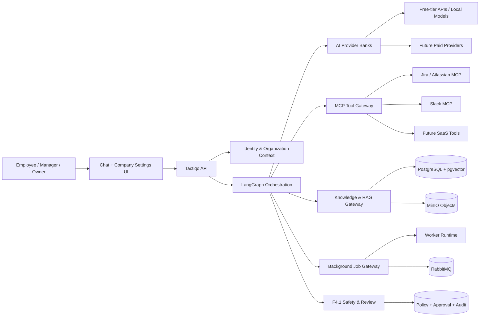
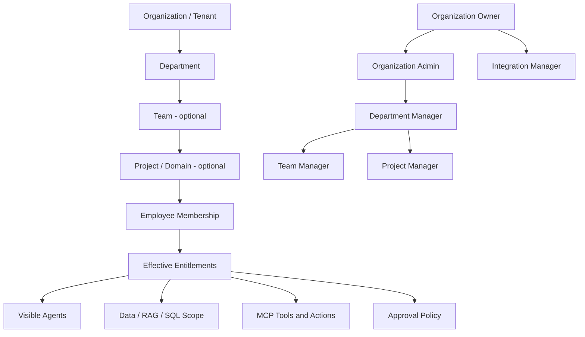
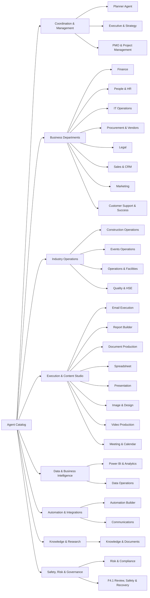
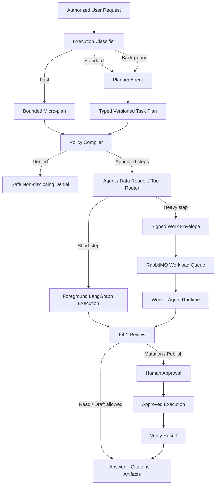
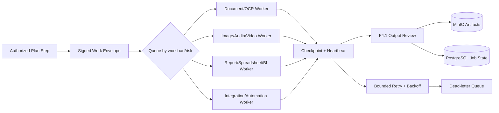
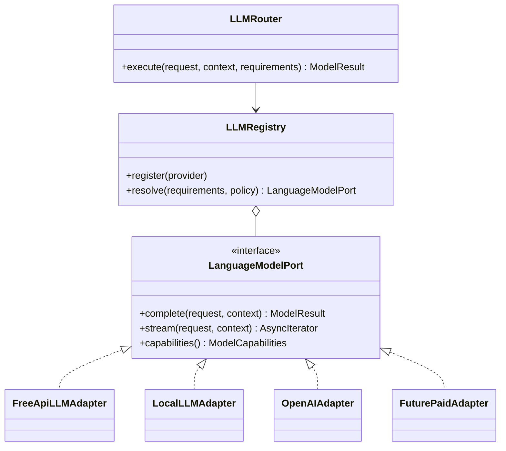
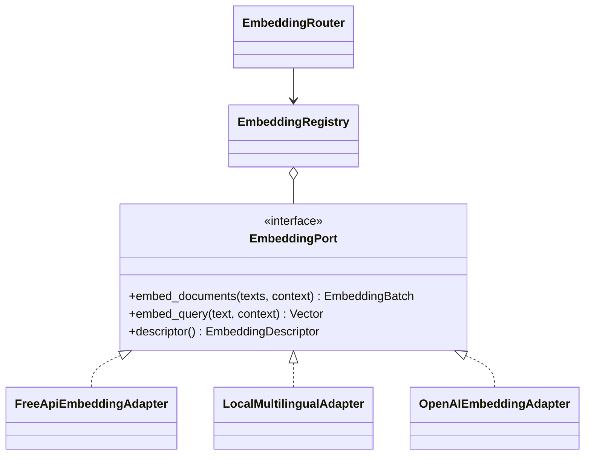
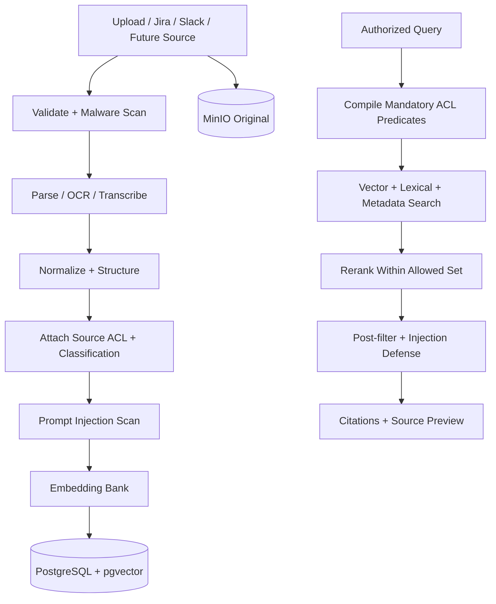
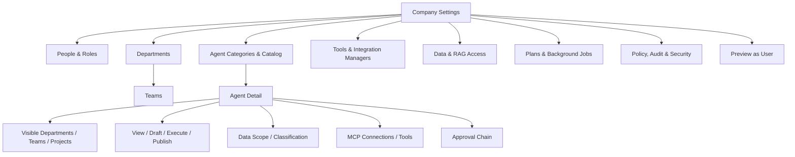

# Tactiqo target architecture

## Purpose

This document is the target architecture agreed for Tactiqo as a scalable,
multi-tenant, chat-first AI Operations SaaS. It combines organization and
department isolation, agent visibility, task planning, foreground/background
execution, MCP tools, future ACL-aware RAG, and replaceable AI providers.

The implementation follows SOLID, dependency inversion, composition over
inheritance, explicit domain boundaries, deny-by-default authorization, and
ports-and-adapters. Free-tier APIs are initial adapters, not business-logic
dependencies. Paid or self-hosted providers are added without rewriting the
free adapters or domain services.

## System context



## Organizational authorization model



Effective access is an intersection, never a union:

```text
tenant
AND role
AND department
AND optional team/project
AND explicit agent assignment
AND resource ACL/classification
AND provider permission
AND action/tool policy
```

The server derives all identity and membership fields. Clients and models cannot
submit, broaden, or override them. Hidden agents, sources, tools, departments,
and record counts are not returned to unauthorized users.

## Agent catalog and categories



An organization can install more domain packs. A configurable Department
Operations Agent covers a new department until a specialized pack is added.

Each agent has separate `visible`, `usable`, `draft`, `execute`, `publish`, and
`administer` grants. Seeing an Email Agent can permit drafting while sending
remains approval-gated. The same separation applies to publishing Power BI,
activating automations, sending Slack/email, exporting sensitive data, and
publishing images, presentations, or video.

## Adaptive task planning and execution



### Execution classification

| Class | Typical characteristics | Runtime |
|---|---|---|
| Fast | One entitled agent, no/heavy-free input, one read tool or simple answer, target under 8 seconds | Foreground micro-plan |
| Standard | Two to five steps, several retrievals/tools, small report, target 8–30 seconds | Foreground Planner |
| Background | Large/multiple files, OCR, audio/video, bulk records, more than five steps, resumable generation or synchronization | Planner + Worker |

Classification combines deterministic limits with a bounded estimate: input
size/type, expected records, agents, tool calls, transformation type, risk,
approvals, memory, output size, and retry/checkpoint needs. A foreground task
can escalate safely to background at a checkpoint without restarting. It never
runs the same side effect twice; every step has an idempotency key.

### Typed plan contract

```text
Plan
  id, version, goal, deliverables
  steps[]
    dependency ids
    assigned agent capability
    assigned data reader
    immutable tenant/department/team/project scope
    RAG collection / SQL view / MCP tool grants
    action: read | draft | execute | publish
    risk and classification
    foreground | background
    timeout, retry, token/cost budget
    approval checkpoint
    completion evidence
```

Planner cannot call mutation tools. Any material plan change triggers policy
recompilation and re-approval.

## Worker runtime



Queue messages contain references, not large files or secrets. Workers restore
the execution scope, compare the current policy version, re-check revoked
memberships/connections, enforce concurrency and quota limits, and stop at safe
checkpoints. The UI exposes progress stages, cancel, retry, approvals, and final
artifacts without making unreliable time promises.

## LLM Bank

The LLM Bank selects an implementation by capability and policy. Application
code depends only on `LanguageModelPort`.



Routing requirements include language, structured output, tool calling,
context length, data classification, residency, latency, availability, quality,
token budget, and monetary budget. Free-tier quotas and availability are not
guaranteed, so the Bank includes circuit breakers, rate-limit handling, health,
bounded fallback, and usage accounting. A fallback is allowed only when its
security/residency capability is equal or stronger; sensitive prompts never
fall back to an unapproved provider.

Adding OpenAI later means implementing `LanguageModelPort`, registering provider
capabilities, adding secrets to the deployment secret manager, and changing
tenant routing configuration. Existing free adapters and agents remain intact.

## Embedding Bank

RAG and ingestion depend only on `EmbeddingPort`; they never import a provider
SDK directly.



Each vector stores `provider`, `model`, `model_version`, `dimensions`,
`normalization`, `language profile`, and `embedding_space_id`. Vectors from
different spaces are never compared. Changing a model creates a new embedding
space and a versioned background re-index job; old and new indexes can run in
parallel until quality gates pass, followed by an atomic active-space switch.

The initial provider must support Arabic and English retrieval. Provider
selection considers privacy, residency, rate limit, batch size, dimensions,
cost, and measured retrieval quality rather than price alone.

## ACL-aware RAG



Every chunk stores tenant, department, optional team/project, classification,
allowed principals, source ACL hash/version, content hash, locator, and
embedding-space metadata. Mandatory predicates are applied in SQL/vector search
before retrieval. Provider content is untrusted data and cannot select tools,
change instructions, or broaden access.

## MCP and tool authorization

Jira, Slack, and future connections are tenant-managed OAuth/MCP adapters.
Organization Owners assign Integration Managers and scope each connection to
departments, teams, projects, agents, and individual tools. Tool discovery is
filtered before definitions reach a model. Arguments are validated before a
call; returned fields are filtered and scanned afterward. Mutations, external
communications, publishing, deletion, financial actions, and automation
activation use configurable approval chains and durable audit.

## Company Settings UI



The employee chat receives only entitled agent cards. The default experience
may show one Tactiqo Agent while the Supervisor delegates invisibly to entitled
specialists. Administrative navigation is server-driven. UI hiding is never an
authorization control; every API repeats the decision.

## Module boundaries

```text
identity/          users, sessions, tenants, server-derived context
organization/      departments, teams, projects, memberships, managers
authorization/     RBAC + ABAC + ReBAC policy compiler and decisions
agents/            catalog, assignments, Planner, Supervisor, domain packs
ai_providers/      LLM Bank and Embedding Bank ports/registries/adapters
integrations/      OAuth connections and provider-specific MCP adapters
tools/             discovery, policy, approvals, execution, audit
knowledge/         ingestion, ACL-aware retrieval, citations, source preview
jobs/              plans, work envelopes, queues, workers, progress, recovery
artifacts/         reports, documents, spreadsheets, BI, images, slides, media
safety/            F4.1 validation, guardrails, fallback, red-team evaluation
```

Dependencies point inward toward domain/application contracts. Provider SDKs,
FastAPI, SQLAlchemy, RabbitMQ, MinIO, model APIs, and vector implementations stay
in infrastructure adapters.

## Non-negotiable controls

- deny by default and prevent cross-tenant identifiers at database boundaries;
- never authorize from model output or browser-submitted scope;
- encrypt provider credentials and platform secrets; never log or prompt them;
- preserve source permissions and classification through ingestion and output;
- require idempotency and approval for impactful actions;
- isolate model and embedding spaces by policy and version;
- record sanitized plan, policy decision, tool call, approval, and artifact lineage;
- fail closed when identity, policy, provider capability, or ACL metadata is missing;
- test tenant, department, team, project, agent, tool, SQL, RAG, and artifact isolation.

