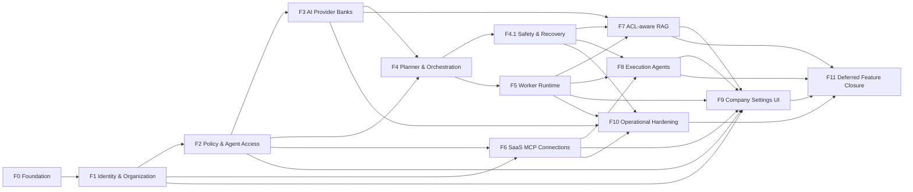

# Tactiqo master implementation plan

## How to use this plan

This is the authoritative execution tracker for building Tactiqo. Work proceeds
in dependency order and a phase is complete only when its exit gate passes.

Status markers:

- `[x]` implemented and verified locally;
- `[~]` foundation exists but the phase is not complete;
- `[ ]` not implemented;
- `[!]` externally blocked or requires an owner/provider decision.

Every pull request and release must reference the relevant task IDs. Updating a
status requires test evidence and corresponding architecture/runbook updates.

## Global definition of done

Every implementation item must satisfy all applicable checks:

- domain, application, and infrastructure boundaries follow SOLID and dependency inversion;
- APIs, migrations, events, queues, and configuration are versioned and documented;
- organization, actor, department, team, project, classification, and policy scope are server-derived;
- authorization is applied before resource lookup to prevent existence leakage;
- secrets are absent from source, browser storage, prompts, queues, logs, traces, and API responses;
- positive, negative, tenant-isolation, failure, cancellation, and retry tests pass;
- Ruff, Mypy, Pytest, ESLint, TypeScript, production build, and migration checks pass;
- observability is sanitized and includes correlation, plan, run, job, approval, and audit identifiers;
- rollback and forward-recovery behavior are documented;
- the deployed behavior matches the engineering constitution and architecture documents.

## Delivery map



---

## F0 — Repository and local platform foundation

Goal: maintain a repeatable local platform and clean architectural boundaries.

### F0.1 Repository governance

- [x] Create product, architecture, ADR, plan, runbook, and integration documentation areas.
- [x] Preserve the engineering constitution and master product specification in the repository.
- [x] Pin selected upstream components and dependency versions.
- [x] Add CODEOWNERS for security, migrations, agents, authorization, integrations, and infrastructure.
- [x] Add pull-request template containing security, migration, rollback, and test checklists.
- [x] Add architecture-decision enforcement: material boundary changes require an ADR.
- [x] Add secret scanning, dependency audit, license checks, and SBOM generation to CI.
- [ ] Add protected-branch rules and required quality gates after GitHub repository access is finalized.

### F0.2 Local infrastructure

- [x] Run PostgreSQL, Redis, RabbitMQ, MinIO, API, Web, Worker, and demo MCP with Docker Compose.
- [x] Add liveness and dependency-aware readiness endpoints.
- [x] Apply Alembic migrations through a dedicated migration container.
- [x] Keep host bindings local by default.
- [x] Add named development profiles for core, integrations, workers, and observability.
- [x] Add backup/restore scripts for PostgreSQL and MinIO test data.
- [x] Add deterministic seed and teardown commands limited to an explicit development tenant.

### F0.3 Current functional baseline

- [x] Chat conversations, messages, runs, SSE progress, cancellation, and checkpoints.
- [x] Deterministic model provider and provider-neutral model port.
- [x] Tool discovery, tool calls, policy classification, approvals, and audit foundation.
- [x] Document upload, object storage, queue publication, and local lexical retrieval foundation.
- [x] Remove Onyx and retain RAG behind provider-neutral ports.
- [x] Create Jira/Slack tenant connection, encryption, verification, disable, and OAuth foundations.

### F0 exit gate

- [x] Current local services start and report healthy.
- [x] Current backend and frontend quality gates pass.
- [ ] CI reproduces every local gate from a clean checkout.

---

## F1 — Production identity and organization hierarchy

Goal: make every request carry a trusted SaaS identity and organizational scope.

### F1.1 Identity boundary

- [x] Define `IdentityProviderPort`, `AuthenticatedPrincipal`, session, and token contracts.
- [x] Select the first identity adapter: generic OIDC Authorization Code + PKCE, with SAML through an identity broker.
- [x] Validate issuer, audience, signature, expiry, nonce, session, replay, and token type.
- [x] Map provider subject to immutable internal user ID; never use mutable email as authority.
- [x] Add login, callback, logout, session refresh, session revocation, and device/session listing.
- [x] Add MFA/step-up authentication requirement for high-risk administration.
- [x] Remove local development identity from staging and production environments.
- [x] Add authentication audit events without tokens or raw claims.

### F1.2 Organization model

- [x] Create `organizations` and `organization_members` domain models and tables.
- [x] Add invitation, activation, suspension, removal, and membership validity periods.
- [x] Add organization status, plan, locale, timezone, data region, and policy version.
- [x] Enforce unique, immutable tenant identifiers and cross-tenant foreign-key integrity.
- [x] Add organization Owner transfer with step-up authentication and durable approval.
- [x] Add tenant lifecycle: provision, suspend, export, retention, and safe deletion workflow.

### F1.3 Roles and managers

- [x] Create roles: Owner, Organization Admin, Integration Manager, Department Manager,
  Team Manager, Project Manager, Employee, and Auditor/Risk Reviewer.
- [x] Separate role definition from role assignment.
- [x] Add scoped assignments with start/end validity and revocation metadata.
- [x] Prevent privilege escalation and self-approval for restricted operations.
- [x] Require Owner authorization for Organization Admin and Integration Manager assignments.
- [x] Record before/after values for privileged assignment changes.

### F1.4 Departments, teams, and projects

- [x] Create departments with code, name, manager, classification ceiling, and status.
- [x] Require every active employee to have at least one department membership.
- [x] Create optional teams under exactly one department.
- [x] Create team managers and team memberships bounded by department membership.
- [x] Create projects/domains and memberships scoped to organization and owning department.
- [x] Support matrix project membership without expanding department data access implicitly.
- [x] Add membership effective dates and immediate revocation propagation.

### F1.5 Execution context

- [x] Extend server-derived `ExecutionContext` with roles, departments, teams, projects,
  classification, data region, session assurance, and policy version.
- [x] Sign/serialize only minimum context for internal work envelopes.
- [x] Reject browser-supplied scope fields and unknown organization identifiers.
- [x] Add current context reconstruction for SSE, LangGraph resume, approvals, and workers.

### F1 tests and exit gate

- [x] Authentication success, expiry, replay, invalid issuer/audience, logout, and revocation tests.
- [x] Tenant, department, team, project, role, manager, and suspended-user isolation tests.
- [x] Direct-object-reference and hidden-resource existence-leakage tests.
- [x] Production and staging startup fail if local identity is enabled.
- [x] Company Owner can build a hierarchy; an Employee cannot access administration APIs.

---

## F2 — Authorization Policy Compiler and Agent Catalog

Goal: calculate exactly which agents, data, tools, and actions each employee can use.

### F2.1 Policy model

- [x] Define resource, subject, action, condition, decision, reason-code, and obligation contracts.
- [x] Combine RBAC, ABAC, and ReBAC into one versioned Policy Compiler.
- [x] Define actions: visible, use, read, draft, execute, publish, administer, approve, export.
- [x] Implement deny-by-default and explicit-deny precedence.
- [x] Add classification, department, team, project, geography, time, and ownership conditions.
- [x] Add approval, redaction, rate, quota, and step-up-auth obligations.
- [x] Cache only safe decisions with membership/policy version invalidation.
- [x] Persist sanitized authorization decisions for audit and explanation.

### F2.2 Agent Catalog

- [x] Define agent category, definition, version, capability, input/output, and risk contracts.
- [x] Add category registry: Coordination, Business, Industry, Execution/Content, Data/BI,
  Automation/Integrations, Knowledge/Research, Safety/Risk/Governance.
- [x] Add install/enable/disable/version lifecycle per organization.
- [x] Add generic Department Operations Agent for future departments.
- [x] Add prompt/template/configuration versioning without embedding permissions in prompts.
- [x] Validate that domain agents depend only on ports and capability contracts.

### F2.3 Agent assignments

- [x] Assign agents to departments, teams, projects, roles, and explicit users.
- [x] Store visible/use/draft/execute/publish/administer grants separately.
- [x] Attach data domains, classification ceiling, connections, individual tools, quotas, and budgets.
- [x] Attach approval chains by agent, action, risk, and target system.
- [x] Compile effective employee agent cards server-side.
- [x] Never return hidden agent or department metadata.
- [x] Re-evaluate assignment on each run/resume and before each high-risk step.

### F2.4 Initial agent packs

- [x] Planner Agent.
- [x] Executive & Strategy Agent.
- [x] PMO & Project Management Agent.
- [x] Construction Operations Agent.
- [x] Events Operations Agent.
- [x] Risk & Compliance Agent.
- [x] Product & Software Development Agent.
- [x] Automation & Integrations Agent.
- [x] Finance Agent.
- [x] IT Operations Agent.
- [x] People & HR Agent.
- [x] Procurement & Vendors Agent.
- [x] Legal Agent.
- [x] Sales & CRM Agent.
- [x] Marketing Agent.
- [x] Customer Support & Success Agent.
- [x] Operations & Facilities Agent.
- [x] Quality & HSE Agent.
- [x] Knowledge & Documents Agent.
- [x] Communications Agent.
- [x] F4.1 Review, Safety & Recovery capability pack.

### F2 tests and exit gate

- [x] Matrix tests for role x department x team x project x action x classification.
- [x] Hidden-agent discovery and direct invocation tests.
- [x] Assignment revocation during active run tests.
- [x] Policy conflict, explicit deny, cache invalidation, and approval-obligation tests.
- [x] Employee API returns only effective agent cards and allowed actions.

---

## F3 — Replaceable LLM Bank and Embedding Bank

Goal: use free APIs first while keeping every provider replaceable and scalable.

### F3.1 Shared provider architecture

- [ ] Create provider identity, capability, health, quota, budget, residency, privacy, and status models.
- [ ] Create generic registry lifecycle: register, validate, enable, drain, disable, remove.
- [ ] Keep provider secrets as secret-manager references, never database/browser plaintext.
- [ ] Add tenant/provider allowlists and classification/residency policies.
- [ ] Add sanitized request accounting, latency, errors, rate limit, token/unit use, and cost estimate.
- [ ] Add circuit breaker, timeout, bounded retry, backpressure, and policy-safe fallback.
- [ ] Add provider conformance-test framework.

### F3.2 LLM Bank

- [ ] Finalize `LanguageModelPort` with complete, stream, structured output, tool-call, and capability contracts.
- [ ] Implement `LLMRegistry`, `LLMRouter`, and selection requirements.
- [ ] Retain deterministic adapter for tests.
- [ ] Select and implement the initial approved free-tier API adapter.
- [ ] Optionally add a local-model adapter for private/offline workloads.
- [ ] Add Arabic/English, structured-output, context-window, and tool-use evaluations.
- [ ] Add quality tiers for fast classification, planning, domain work, and review.
- [ ] Add per-agent and per-tenant routing policies and budgets.
- [ ] Define paid-provider adapter checklist.
- [x] Add OpenAI adapter through registration only; do not edit free adapters.
- [x] Add Owner UI/API onboarding for official OpenAI using a write-only encrypted
  local-development secret reference.
- [ ] Add Azure OpenAI and approved OpenAI-compatible providers using managed
  secret-manager references and explicit region/egress policies.
- [ ] Add create/rotate/revoke credential lifecycle, masked status, connection test,
  provider allowlists, egress policy, and explicit confirmation before activation.

### F3.3 Embedding Bank

- [ ] Define `EmbeddingPort`, batch/query contracts, and descriptor.
- [ ] Implement `EmbeddingRegistry`, `EmbeddingRouter`, and policy-aware selection.
- [ ] Select an initial Arabic/English free-tier API and/or approved local adapter.
- [ ] Add provider batch/rate/size handling and deterministic test adapter.
- [ ] Define `embedding_space_id` from provider/model/version/dimensions/normalization.
- [ ] Prevent cross-space vector comparisons.
- [ ] Add parallel old/new index support and active-space pointer.
- [ ] Add background re-index, validation, atomic cutover, rollback, and old-index retention.
- [ ] Add future OpenAI embedding adapter through registration only.

### F3 tests and exit gate

- [ ] LLM and embedding adapter conformance tests.
- [ ] Free quota exhaustion, provider outage, timeout, and circuit-breaker tests.
- [ ] Sensitive-data fallback and residency-negative tests.
- [ ] Arabic/English quality thresholds are measured and documented.
- [ ] Switching configured adapters changes no agent, RAG, or business-service code.

---

## F4 — Planner, Supervisor, and adaptive LangGraph orchestration

Goal: plan every non-trivial task, keep small tasks fast, and route only authorized work.

### F4.0 Execution classifier

- [ ] Define Fast, Standard, and Background classes with configurable hard limits.
- [ ] Estimate file/media type and size, records, tools, agents, steps, output, risk, and approvals.
- [ ] Use deterministic fast-path rules before any planning-model request.
- [ ] Record classification reason and estimates without sensitive content.
- [ ] Permit safe foreground-to-background escalation at a checkpoint.
- [ ] Prevent duplicate side effects during escalation with step idempotency keys.

### F4.1 Typed Planner Agent

- [ ] Define plan, version, step, dependency, deliverable, evidence, budget, and status models.
- [ ] Make Planner output strict schema, never free-form executable instructions.
- [ ] Assign one entitled agent and data reader to every step.
- [ ] Declare exact data scope, RAG collection, SQL view, MCP connection/tool, and action level.
- [ ] Declare foreground/background mode, timeout, retry, quota, risk, and approval checkpoint.
- [ ] Prevent Planner from calling mutation tools or expanding user scope.
- [ ] Compile/authorize each step before retrieval or execution.
- [ ] Re-authorize material plan changes and resumed plans.
- [ ] Support parallel branches only when dependencies and shared-resource limits permit.

### F4.2 Supervisor Graph

- [ ] Implement nodes for authenticate, classify, plan, authorize, route, retrieve, call,
  draft, review, approval, execute, verify, respond, cancel, and recover.
- [ ] Store checkpoints in PostgreSQL with organization/run/policy version.
- [ ] Propagate correlation, plan, step, approval, tool, job, and artifact IDs.
- [ ] Enforce maximum iterations, tool calls, elapsed time, tokens/units, and monetary budget.
- [ ] Add deterministic terminal states and safe partial-result behavior.
- [ ] Add resumable approval and cancellation paths.

### F4 tests and exit gate

- [ ] Fast requests avoid a separate Planner model call and meet performance budget.
- [ ] Standard/background plans validate against the strict schema.
- [ ] Unauthorized steps perform zero data reads and zero tool calls.
- [ ] Parallel/dependency, budget, cancellation, resume, escalation, and idempotency tests pass.
- [ ] Every final answer links to plan/run/audit evidence internally.

---

## F4.1 — Independent review, guardrails, fallback, and assurance

Goal: provide an independent control plane around planning, retrieval, tools, and outputs.

### F4.1.1 Input and plan protection

- [ ] Detect instruction injection, impersonation, secret requests, scope expansion, and unsafe intent.
- [ ] Review plan scope, selected agents/readers/tools, risk, budget, and approvals.
- [ ] Reject plans referencing hidden resources or undeclared actions.
- [ ] Keep safety rules deterministic where possible; model review is supplemental.

### F4.1.2 Retrieval and tool protection

- [ ] Treat documents, Jira, Slack, email, web, and MCP output as untrusted data.
- [ ] Isolate source text from system/tool instructions.
- [ ] Validate tool arguments against schema, scope, policy, and target allowlists.
- [ ] Redact secrets, sensitive fields, and unauthorized cross-scope content after tool return.
- [ ] Require approval for mutation, deletion, send, publish, export, financial, and automation activation.

### F4.1.3 Output and artifact review

- [ ] Validate citations, claims, classification, recipients, destinations, and templates.
- [ ] Scan generated documents, spreadsheets, slides, images, audio, and video metadata/content.
- [ ] Block unsafe publication and preserve a safe draft where policy allows.
- [ ] Mark uncertainty and incomplete evidence rather than fabricate completion.

### F4.1.4 Fallback and recovery

- [ ] Define provider, tool, retrieval, worker, partial-output, and approval-timeout fallbacks.
- [ ] Retry only idempotent operations or calls carrying an idempotency key.
- [ ] Never weaken authorization/privacy/residency during fallback.
- [ ] Add recovery playbooks and user-visible safe status messages.
- [ ] Version safety policies and store sanitized decision evidence.

### F4.1 exit gate

- [ ] Prompt/document/tool injection test suite passes.
- [ ] Data exfiltration, confused-deputy, cross-agent, and approval-bypass tests pass.
- [ ] Citations and high-risk artifact validation meet defined thresholds.
- [ ] No production RAG or execution agent activates before this gate.

---

## F5 — Durable Worker Agent Runtime

Goal: execute large files, media, reports, BI, and bulk processes safely in the background.

### F5.1 Job domain

- [ ] Define job, step, attempt, lease, checkpoint, progress, artifact, cancellation, and failure models.
- [x] Create signed immutable work-envelope schema with references and minimum authorized scope.
- [ ] Add idempotency key and deduplication window per executable step.
- [ ] Persist state transitions with optimistic concurrency and audit.
- [ ] Add job ownership and visibility rules matching the originating plan.

### F5.2 Queues and workers

- [~] RabbitMQ publisher/consumer foundation exists for ingestion.
- [ ] Split queues by document/OCR, media, report/BI, integration/automation, and risk class.
- [ ] Add bounded concurrency, priority, fair tenant scheduling, rate and resource limits.
- [ ] Add leases, heartbeat, retry with jitter/backoff, maximum attempts, and DLQ.
- [ ] Store large inputs/outputs in MinIO; messages contain references only.
- [ ] Rebuild context and re-check current membership, policy, connection, and source ACL at checkpoints.
- [ ] Add safe cancellation, worker shutdown, resume, and orphan recovery.

### F5.3 Progress and operations

- [ ] Emit durable progress stages and units completed/total where measurable.
- [ ] Add cancel, retry, and approval-wait APIs.
- [ ] Add DLQ inspection/replay restricted to operations administrators.
- [ ] Add queue depth, age, saturation, attempts, failures, and tenant usage metrics.
- [ ] Add artifact lineage and retention lifecycle.

### F5 tests and exit gate

- [ ] Crash/restart resumes without duplicate side effects.
- [ ] Revoked access stops long jobs at the next safe checkpoint.
- [ ] Cancellation, retry, poison work, DLQ, fairness, and capacity tests pass.
- [ ] Queue and log inspection reveal no raw files, tokens, prompts, or sensitive outputs.

---

## F6 — SaaS MCP connections and scoped tool management

Goal: let owner-assigned managers connect tools while limiting visibility and actions.

### F6.1 Connection lifecycle

- [x] Define tenant/personal Jira and Slack connection model.
- [x] Encrypt credentials at rest and erase them on disable.
- [x] Add OAuth start/callback, signed short-lived state, PKCE, token exchange and refresh.
- [x] Validate provider hostnames and prevent arbitrary endpoint SSRF.
- [x] Add connection list, verify and disable APIs and UI.
- [x] Add provider revocation state and explicit revoked/expired/error transitions.
- [~] Add token/key rotation runbook; production KMS/HSM adapter remains deployment work.
- [x] Add reconnect and credential rotation flow; OAuth consent-scope change reuses reconnect.

### F6.2 Management and scope

- [x] Require owner-assigned Integration Manager for organization connections.
- [ ] Allow personal OAuth connections only when organization policy permits.
- [x] Assign connections to departments, teams, projects, agents, users, and individual MCP tools.
- [x] Separate read, draft, execute, and administrative tool grants.
- [x] Filter tool discovery before definitions enter model context.
- [x] Apply provider ACL and internal policy intersection on every discovery and call.
- [ ] Add per-connection quota, health, last verification, consent, expiry, and audit views.

### F6.3 Providers

- [~] Jira Rovo MCP flow implemented; real calls require an eligible customer site and consent.
- [~] Slack MCP flow implemented; real flow requires Slack App Client ID/Secret and workspace approval.
- [ ] Add email provider through OAuth/MCP or a provider adapter.
- [ ] Add calendar provider.
- [ ] Add future Trello, Confluence, CRM, storage, ERP/procurement, and industry connectors through registry.

### F6 tests and exit gate

- [x] Secret non-return, encrypted storage, and erase-on-disable smoke tests.
- [x] Jira OAuth authorization URL and PKCE start verified against live Atlassian metadata.
- [ ] Real Jira and Slack read and approval-gated mutation tests in non-production workspaces.
- [~] Manager, hierarchy, hidden-tool, revocation, refresh, and result-filter tests; live provider
  ACL tests require customer non-production workspaces.

---

## F7 — ACL-aware multilingual RAG

Goal: retrieve Arabic/English evidence without leaking unauthorized content.

### F7.1 Source and document model

- [x] Define source, document, version, chunk, locator, ACL snapshot, classification, and lineage.
- [ ] Add source connectors and synchronization checkpoints.
- [ ] Store originals and generated previews in MinIO under tenant-scoped keys.
- [x] Store normalized structure and metadata in PostgreSQL.
- [~] Add content hashes, version deduplication, supersession, retention, legal hold, and immediate
  source revocation with derived-index purge; retention APIs and approval workflows remain.

### F7.2 Parsing and enrichment

- [~] Allow 100 MB local test uploads now; replace the single-request limit with resumable
  tenant-scoped multipart uploads and background ingestion jobs for larger files, with progress,
  retry, cancel, quotas and organization-configurable bounds before production.

- [~] Validate MIME/signature, size, archive depth, encryption, and parser limits; external malware
  engine integration remains.
- [x] Parse PDF, Word, Excel, CSV, PowerPoint, text, and Markdown.
- [ ] Add OCR for scanned documents/images.
- [ ] Add audio/video transcription and timestamped locators.
- [ ] Preserve pages, headings, tables, sheets/cells, slides, timestamps, authors, and source URLs.
- [~] Detect language and normalize Arabic/English safely; quality evaluation remains.
- [x] Attach source ACL and classification before chunking/indexing.
- [x] Scan untrusted content for prompt/tool injection indicators.

### F7.3 Indexing and retrieval

- [x] Add pgvector and versioned embedding spaces through Embedding Bank.
- [x] Add PostgreSQL full-text lexical indexes and metadata filters.
- [x] Implement hybrid vector + lexical retrieval and rank fusion.
- [x] Apply mandatory tenant/department/team/project/user/classification predicates in queries.
- [ ] Rerank only the already-authorized candidate set.
- [x] Revalidate ACL before returning context and preview.
- [~] Return citations with page/sheet/cell/slide locator; media and connector locators remain.
- [x] Add source preview without exposing adjacent unauthorized content.

### F7.4 Quality and security evaluation

- [~] Build Arabic, English, mixed-language and security evaluation sets; representative tables,
  scanned files, and media sets remain.
- [x] Measure recall, precision, MRR/nDCG, citation correctness, answer grounding, and latency.
- [~] Test ACL isolation, hidden existence, malformed files, and stale-index deletion;
  customer-workspace membership revocation and ingestion retry drills remain.
- [x] Test direct/indirect prompt injection and poisoned documents.
- [x] Define minimum quality thresholds before activating a new embedding space.

### F7 exit gate

- [ ] Zero unauthorized chunks enter model context across the isolation suite.
- [ ] Every factual document answer has authorized resolvable citations.
- [~] Source revocation purges derived indexes immediately; customer connector and membership
  revocation propagation remains to be certified.
- [ ] Arabic/English retrieval meets the accepted evaluation thresholds.

---

## F8 — Execution agents and artifact production

Goal: turn authorized plans into controlled business outputs and actions.

### F8.1 Shared artifact foundation

- [~] Define artifact request, draft, immutable version, review decision, approval/publication
  states, lineage and tenant report templates; richer format templates and configurable approval
  chains remain.
- [x] Add format-specific renderer ports and registries.
- [~] Persist classification and scope; tenant brand/footer/classification marks, report templates,
  Legal Hold and hold-aware retention purge are live; richer template catalogs remain.
- [~] Store artifacts in MinIO with authorized checksum-verified download; rich preview remains.
- [~] Validate platform-owned citation references and store data lineage; citation resolvability
  and factual completeness evaluation remain.
- [~] Enforce a tenant monthly artifact-count quota and store artifact/byte/unit/cost facts;
  provider-fed units, plan-aware budgets and charging remain.

### F8.2 Execution agents

- [ ] Email: draft, reply, schedule, send, attachments, recipients, follow-up.
- [~] Reports: governed cited Markdown and template-based report drafts are live; richer exported
  report layouts remain.
- [ ] Power BI: data preparation, semantic model/measures, dashboard proposal, refresh and publish.
- [ ] Automation: design, validate, dry-run, activate, monitor, pause and rollback.
- [ ] Images: generate/edit diagrams, branded graphics, campaign and site assets.
- [~] Presentations: native PPTX draft generation is live; speaker notes, visual validation and
  organization slide templates remain.
- [ ] Video: storyboard, script, captions, generation/edit/render/export workflows.
- [~] Documents: native DOCX drafts are live; PDF rendering and controlled contract workflows remain.
- [~] Spreadsheets: native formula-injection-safe XLSX drafts are live; formulas, charts and model
  validation remain.
- [ ] Meetings/Calendar: agenda, invitations, scheduling, minutes, decisions and tasks.
- [ ] Data Operations: cleanup, mapping, validation, import/export and synchronization.
- [ ] Social/Campaign: draft, brand review, schedule and approved publication.

### F8.3 Action controls

- [x] Draft is the default for external communication and publication.
- [~] Validate bounded email/channel/workspace/site/project/file destinations without persisting
  plaintext; provider-side existence and audience verification remain.
- [~] Require independent recorded approval before artifact publication; configurable chains for
  send, overwrite, delete, financial and activation actions remain.
- [~] Provider-neutral execution verifies results and stores external identifier/status; Dry-run and
  tenant-mapped MCP adapters are live, with real Jira/Slack success pending tenant credentials/grants.
- [x] Persist tenant-scoped idempotent validated action preflights and bounded explicit retry attempts.
- [~] Provider compensation contract, persisted reference and idempotent dry-run compensation are
  live; real-provider compensation remains adapter-dependent.

### F8 tests and exit gate

- [ ] Format render/visual validation and artifact security tests.
- [~] Brand/classification policy and approval/publication-negative tests exist; recipient,
  destination, positive two-person publication and richer format coverage remain.
- [~] Provider failure, duplicate request, retry, verification and rollback tests cover Dry-run and
  fail-closed MCP behavior; real-provider reversal needs an explicit reverse-tool mapping and tenant.
- [ ] No execution agent can exceed its assigned department/data/tool/action scope.

---

## F9 — Complete employee and Company Settings UI

Goal: keep chat simple for employees and make administration understandable and safe.

### F9.1 Employee experience

- [x] Chat-first shell, conversations, streaming progress, citations foundation, approvals and cancel.
- [x] Return only policy-effective cards for operational LangGraph routes; catalog-only packs stay hidden.
- [~] Show agent category and allowed actions; output types and connected tools remain.
- [~] Show the compiled route, bounded step count and operational agent during active runs; detailed
  step state, assigned data readers and resolved tool names still need a full plan UI.
- [~] Show real background job progress or explicit indeterminate status, approval wait, cancel/retry
  and artifacts; checkpoint-to-artifact linkage remains.
- [~] Arabic-first layout, responsive styles and user-facing safe errors are present; formal
  accessibility, focus-order and keyboard/browser certification remain.
- [~] Browser-local language and theme controls, notification center, independent personal/company
  dialogs, and scrollable agent catalog/assignment lists are being added. This first increment
  localizes the shell and key dialogs; translations across all admin forms/messages, a server-backed
  profile, durable cross-device notifications and accessibility verification remain.

### F9.2 Company Settings navigation

- [~] Server-derived administrative navigation for implemented sections is live; full entitlement-
  compiled hierarchy and remaining sections are still required.
- [~] Overview shows visible operational counts and enabled providers; security health and required
  action feed remain.
- [~] Owner/Admin-only people directory shows member status, clearance and active roles. Department-
  bound, one-time invitation links are generated without email, expire after 72 hours, support
  revocation and create a standard employee membership after OIDC login. Owner + step-up can now
  suspend/reactivate members (suspension revokes tenant sessions); role history and privileged
  grant/revoke controls are wired with last-Owner/self-change protections. OIDC acceptance still
  needs a live configured IdP test.
- [~] Departments can be listed/created with an optional validated manager and classification ceiling;
  membership can be assigned from the employee list. Agent/data-scope management remains.
- [~] Teams can be listed/created under a department with an optional validated manager; membership
  assignment enforces department ancestry. Agents and inherited-constraint editing remain.
- [~] Projects can be listed/created under a department with an optional validated manager and
  member assignment; data/tool scope and policies remain.
- [~] Agent assignment screen now shows tenant-scoped grants and supports guarded allow/deny and
  revocation for departments, teams, projects and users. Admins can now browse the 35 seeded
  definitions/versions and install, enable or disable agents. Assignment-level tool/connection/data
  scopes, quotas/budgets, obligations, and approval-chain configuration UI remain; stored attachment
  references are not yet a complete enforcement surface.
- [~] Integration UI supports connection creation, OAuth, health checks, disable and revoke;
  accountable manager assignment and full tool-level scope lifecycle remain.
- [~] Personal/company source lists expose classification and processing health; inherited ACL
  preview and sync/index administration remain.
- [~] My Knowledge and Company Knowledge have separate views and API filters. Existing files default
  to personal; only Owner/Organization Admin may create/promote company sources, with exact-name
  confirmation, audit and atomic ACL update. Rich ACL preview and independent high-impact approval
  remain.
- [x] Post-file-selection metadata dialog works for chat and Knowledge uploads; accepted chat
  attachments remain visible while ingestion continues in the background.
- [~] Artifact brand/classification/retention/quota policy and provider-routing screens exist;
  approval, audit, security, consolidated usage and the remaining policy screens remain.
- [~] Jobs drawer lists visible work and supports cancel/retry with truthful progress; per-plan
  checkpoints, worker diagnostics and artifact lineage remain.

### F9.3 Policy preview

- [~] `Preview access` resolves the employee's current server context at standard assurance (not
  login impersonation), and compares allowed agents/actions before and after one hypothetical
  non-Owner role or department/team/project membership add/remove. The simulation writes no policy
  or membership changes; department removal drops its descendant memberships from the proposed
  context and adding a team/project requires current department membership.
  It now also lists a bounded, read-only summary of active effective Jira/Slack grants for the
  current employee context; it does not simulate grant changes. Source categories, resource-level
  scopes, and proposed ACL edits are not covered yet.
- [~] Allowed agents carry an `allowed` reason code; tool summaries show provider, connection label,
  tool and permission but do not yet explain policy reasons; source reasons are not implemented.
  Preview omits denied-agent metadata and hidden document content/counts/secrets.
- [~] Proposed role and organizational membership changes show gained/lost agents and before/after
  allowed actions. Current effective tool grants are displayed separately, but simulation of
  department/team/project tool grants and knowledge-ACL edits remains open.
- [~] High-impact member-role changes have confirmation plus Owner/step-up checks. A general
  policy-change approval workflow is not yet implemented.

### F9 tests and exit gate

- [~] Initial accessibility/responsive/browser/keyboard smoke: mobile overflow fixed; common
  viewports and knowledge scope keyboard navigation verified. Formal accessibility audit and
  cross-browser certification remain.
- [~] HTTP denials cover unauthenticated access preview plus employee denial across ten company
  admin/list/mutation routes; malformed preview scenarios stop before delegated target lookup.
  Broader UI entitlement, step-up/Owner negative paths, and API negative-path coverage remain.
- [ ] Destructive confirmation, stale update, concurrent admin and safe-error tests.
- [ ] Owner can configure a company end-to-end without editing environment files.

F9 remains active. The current-access agent preview is implemented and smoke-tested, but proposed
department/team/project/tool/source ACL policy diff, tool/source ACL explanation, remaining company
settings, formal accessibility/cross-browser coverage, destructive/stale/concurrent mutation gates,
and full owner multi-user end-to-end setup remain open. Do not mark this phase complete until those
gates pass.

---

## F10 — Observability, security, scalability, and operational hardening

Goal: harden the already implemented platform capabilities and establish measurable, secure
operations. F10 can proceed against the current local/test deployment while unfinished product
capabilities remain explicitly deferred to F11. F10 completion is not authorization to release a
production SaaS or claim F7/F8/F9 complete.

### F10.1 Observability and operations

- [x] Structured JSON HTTP completion logs use only an allowlist (correlation ID, method, route
  template, status and duration); request/query/body/secrets and exception details are not logged.
- [~] Process-local HTTP, AI provider, MCP tool-call, retrieval, ingestion-publish and API-owned
  object-storage metrics, safe HTTP completion logs, worker delivery/storage JSON events and signed
  correlation propagation into worker logs are active. Local authenticated Prometheus scrapes API
  and worker metrics, and a loopback-only Grafana dashboard is provisioned. Metrics remain
  process-local; continuous queue depth, cross-process traces and multi-replica aggregation remain.
- [x] Local loopback Grafana dashboard for current API, provider, MCP, retrieval, queue, worker and
  storage signals; this is not a customer/production dashboard.
- [~] Provisional local Prometheus investigation rules cover target availability, HTTP errors and
  latency, provider/tool/worker failures and queue depth freshness. SLO calibration, authorization
  anomaly/cost metrics, Alertmanager delivery and capacity tests remain.
- [~] Local observability guidance now includes read-only triage playbooks for provider/model,
  Jira/Slack MCP, metrics authentication, queue/worker, failed deployment/migration and suspected
  data loss. A guarded local backup/verify/restore utility exists and its destructive scope is now
  explicit in the runbook. These do not constitute production backup/restore: encrypted off-host
  copies, retention, isolated restore drills, executable deployment rollback and incident exercises
  remain.
- [ ] Capacity/load tests for tenant fairness, concurrent runs, retrieval and large jobs.

### F10.2 Security and governance

- [ ] Threat model every trust boundary and update it for new providers/tools.
- [ ] KMS/HSM key custody, envelope encryption, rotation and emergency revocation.
- [ ] Network egress allowlists, SSRF controls, TLS, headers, cookies, CORS and rate limits.
- [ ] Dependency/SBOM/container scanning and signed build artifacts.
- [ ] Audit export, retention, legal hold, privacy request and tenant deletion workflows.
- [ ] Penetration, red-team, incident simulation and disaster-recovery exercises.

### F10.3 Deployment and release

- [ ] Define development, test, staging and production environments with isolated secrets/data.
- [ ] Add infrastructure-as-code and managed PostgreSQL/object/queue equivalents as selected.
- [ ] Add zero-downtime migration, canary/rollback and compatibility policies.
- [ ] Add backups, point-in-time recovery, restore verification and regional strategy.
- [ ] Add tenant provisioning, plan/feature flags, quotas, billing meters and support tooling.
- [ ] Complete security, legal, privacy, acceptable-use and customer administration documentation.

### F10 exit gate

- [ ] Operational-hardening gate passes: telemetry and alerting for the currently deployed paths,
  threat-model review, security baseline, capacity tests, backup/restore and incident runbooks pass.
- [ ] No production release is allowed until F11 closes all deferred F7/F8/F9 feature and evidence
  gates, and a release candidate passes real-provider and multi-tenant certification.
- [ ] Production contains no development identity, deterministic model, sample secrets, or demo MCP.

---

## F11 — Deferred F7/F8/F9 feature closure and release certification

Goal: return to every explicitly deferred product capability after F10 operational hardening; close
each original phase exit gate with implementation and evidence. Deferral is not completion or a
waiver of security requirements.

### F11.1 Deferred F7 — RAG closure

- [ ] Connector synchronization/checkpoints, OCR/transcription, exact locators, authorized-candidate
  reranking, representative retrieval evaluation, revocation drills, resumable large uploads and
  accepted Arabic/English quality thresholds; preserve all original requirements under F7.1–F7.4.
- [ ] Meet the original F7 exit gate: zero unauthorized chunks, resolvable citations for document
  answers, immediate revocation propagation, and accepted Arabic/English retrieval results.

### F11.2 Deferred F8 — execution and artifact closure

- [ ] Close every unchecked/partial F8.1–F8.3 item: complete email, Power BI, automation, image,
  video, meetings/calendar, data-operations and social agents; richer Office/PDF outputs and visual
  QA; approval chains; real provider success, destination validation, reversal and scope proof.
- [ ] Meet the original F8 exit gate: artifact security/format tests, independent approval positives
  and negatives, retry/verification/rollback, and no execution beyond assigned department/data/tool
  scope.

### F11.3 Deferred F9 — settings and employee experience closure

- [ ] Close remaining Company Settings and policy-preview scope: tool grants and policy reasons,
  knowledge/source/document ACL explanations, budgets/quotas/approval configuration and full owner
  setup. Resolve company-wide versus department/team knowledge readership as an explicit policy.
- [ ] Complete stale/concurrent/destructive mutation gates; broader role/entitlement negative paths;
  formal accessibility and cross-browser certification; and real OIDC multi-role setup acceptance.

### F11.4 Employee UI experience follow-up

- [ ] Complete bilingual Arabic/English coverage, persistent notification center, light/dark
  accessibility checks, scrollable agent catalog/assignments, and separate personal/company
  settings dialogs; profile values remain browser-local until a server identity/profile contract is
  approved.
- [ ] Add Gamma API only as a governed presentation-generation adapter after provider contract,
  credential custody, approval, artifact review and cost controls are defined.

### F11.5 Release certification

- [ ] Run a full non-production SaaS release candidate across real Jira/Slack, RAG, planner, worker,
  approvals and artifact flows with at least two roles and tenant-isolation verification.
- [ ] Complete security review, load/restore/DR exercises, operational readiness and customer-facing
  administration/privacy documentation. Production release remains blocked until these pass.
- [ ] Deferred to the final closeout pass: perform the isolated local backup/restore drill, then
  define production-grade encrypted off-host backup custody, retention, RPO/RTO and recovery
  evidence. The local restore command is destructive; do not run it on user or shared data during
  feature implementation.

### Final deferred work register

- [ ] Perform the isolated local backup/restore drill, then define production-grade encrypted
  off-host backup custody, retention, RPO/RTO and recovery evidence. The local restore command is
  destructive; do not run it on user or shared data during feature implementation.

---

## Immediate execution sequence

The immediate execution sequence is now:

1. `[F10.1 complete]` Sanitized structured HTTP telemetry with safe route templates and correlation IDs.
2. `[F10.1–F10.13 in progress]` HTTP/worker, AI provider, MCP, retrieval, ingestion-publish and
   storage telemetry are implemented; queue-depth snapshots, authenticated local Prometheus API
   and worker collection exist. Metrics remain process-local; continuously refreshed queue signals,
   multi-replica aggregation and cross-process traces remain.
3. `[F10.14 complete locally]` A provisioned loopback-only Grafana dashboard covers current API,
   worker, AI, tools, retrieval, ingestion and storage metrics; thresholds still need load-test
   calibration and are not production SLOs.
4. `[F10.15–F10.17 locally implemented]` Added worker target/failure, API latency and queue-snapshot
   freshness rules, dashboard indicators, deterministic promtool tests and a CI gate. Triggers remain
   provisional and non-notifying; hosted CI evidence is pending the next push/PR run.
5. `[F10.1–F10.2]` Define SLOs/alerts, threat model, secret/key custody and network/security baseline.
6. `[F10.3]` Establish isolated environments, migration/rollback, backup/restore and incident runbooks.
7. `[F10]` Pass the operational-hardening gate for currently shipped functionality (not production release).
8. `[F11.1–F11.3]` Close deferred F7 RAG, F8 execution and F9 settings/product requirements.
9. `[F11.4]` Complete SaaS release certification; only then consider production release.

## Progress review format

At the end of each implementation increment, record:

```text
Task IDs completed:
Files/migrations/APIs changed:
Security and authorization behavior:
Tests and evidence:
Manual verification:
Known limitations:
Rollback path:
Next unblocked task IDs:
```
