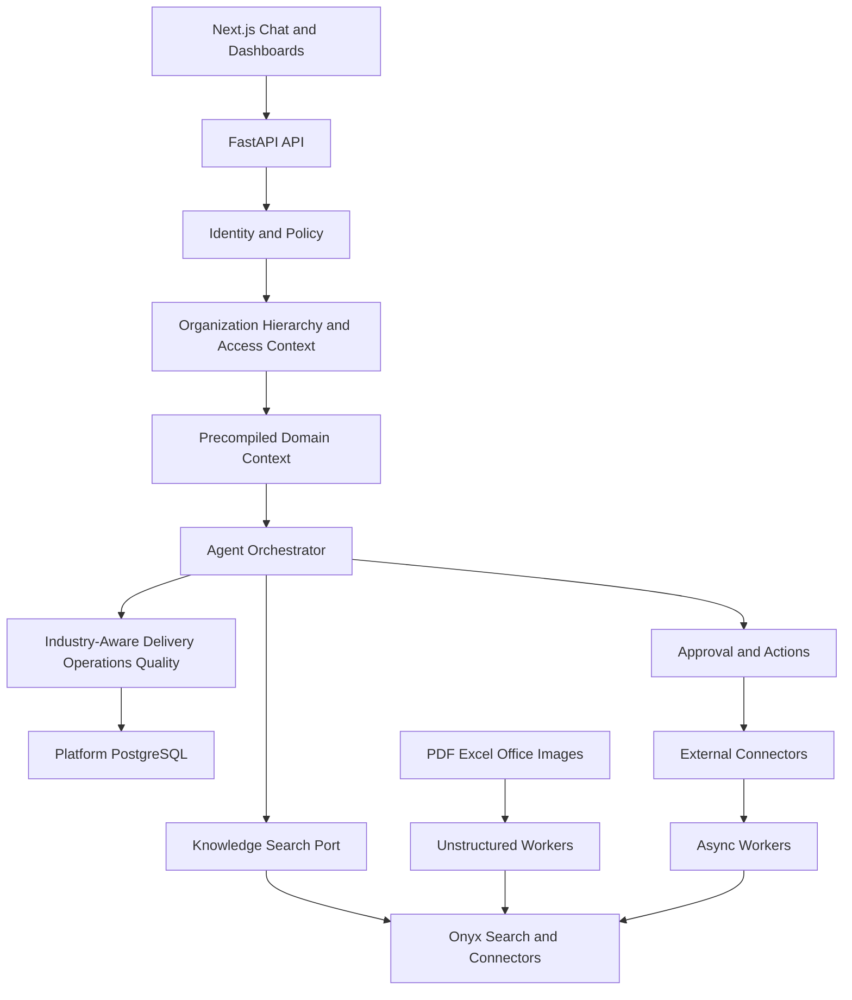

# AI Operations, Delivery & Quality Intelligence Platform

## Master Product and Technical Specification for Codex

**Document status:** Consolidated working baseline — ready for implementation planning
**Purpose:** This document is the source of truth for product discovery, architecture, backlog generation, and implementation with Codex.
**Working product name:** Tactiqo AI Operations Platform (temporary; configurable later)
**Primary interface:** Conversational chat with operational dashboards
**Backend:** Python 3.12+, FastAPI
**Frontend:** Next.js/React/TypeScript (MERN-style frontend)
**Primary database:** PostgreSQL

---

## 1. Executive Summary

Build a dedicated B2B enterprise AI platform for project-management, PMO, delivery, and business-operations organizations across multiple industries. Each customer receives a dedicated deployment hosted in the customer's or provider's AWS/Azure environment. The platform connects to the company's project, communication, document, ERP/procurement, field-operation, email, calendar, and—when relevant—engineering tools. It continuously synchronizes authorized data, normalizes it into a configurable organizational and operational model, and allows users to interact through a chat-first interface.

The platform is not only a chatbot or a document RAG system. It acts as an AI-assisted:

- Operations Manager
- Project Manager
- Program/Portfolio Manager
- Scrum Master (when the Agile pack is active)
- Industry-specific Manager (for example Construction, Events, Consulting, or Software Delivery)
- Delivery Manager
- Quality Manager
- Risk Manager
- Coordination and Follow-up Manager
- Reporting and Executive Intelligence Assistant

The platform must understand tasks, documents, conversations, decisions, meetings, risks, milestones, dependencies, deliverables, inspections, approvals, defects, quality evidence, people, teams, vendors, and resources. Optional industry packs extend this model with concepts such as construction packages, event run sheets, permits, procurement items, or software releases. It must connect these objects together, identify operational problems, generate evidence-backed recommendations, and safely execute approved actions in connected systems.

The platform MUST support companies and projects whose primary operational system of record is a set of documents rather than a task-management platform. Contracts, PDFs, Excel trackers, plans, schedules, reports, meeting minutes, invoices, policies, and approvals can collectively define project truth. Connecting Jira, Asana, ClickUp, or another task platform is optional—not a prerequisite for delivery, risk, quality, reporting, or PM intelligence.

The product must provide strict department/unit data separation, hierarchical managerial visibility, source-level permission enforcement, auditability, traceability, reliable citations, configurable governance, and human approval before sensitive actions.

---

## 2. Product Vision

### 2.1 Vision statement

Create an AI operating layer for organizational delivery and business operations: one place where leaders and teams can ask what is happening, why it is happening, what is at risk, what must happen next, and—after approval—allow the system to coordinate the necessary work.

### 2.2 Main value proposition

Organizations often have fragmented operational data:

- Tasks in Jira, Asana, ClickUp, or Trello
- Discussions and decisions in Slack or Microsoft Teams
- Requirements in Notion, Confluence, Google Drive, or SharePoint
- Industry evidence such as site reports, procurement records, event run sheets, contracts, designs, approvals, or software repositories
- Meetings in Google Calendar or Outlook
- Actions and approvals in email
- Reports in spreadsheets and manually maintained documents

The platform creates a unified, permission-aware operational view and uses AI agents to:

1. Discover and summarize current status.
2. Detect delays, blockers, risks, quality gaps, and conflicting information.
3. Connect decisions, requirements, tasks, domain evidence, quality checks, approvals, and delivery.
4. Recommend prioritized actions with reasons and evidence.
5. Prepare reports, follow-ups, tasks, and notifications.
6. Execute authorized actions only under explicit policy and approval.
7. Learn from feedback without silently changing organizational truth.

### 2.3 Product positioning

Suggested product category:

> Industry-adaptive Conversational AI Project, Delivery, Quality, and Business Operations Intelligence Platform.

This is broader than an AI project management tool and more controlled than a general autonomous agent platform.

---

## 3. Business Problems

The platform addresses the following problems:

### 3.1 Fragmented truth

Project state is distributed across multiple tools. A status report may conflict with task data, recent messages, site or field evidence, procurement records, financial data, acceptance records, or the latest approved plan.

### 3.2 Manual follow-up

Operations and project managers spend significant time asking for updates, collecting evidence, updating trackers, and preparing management reports.

### 3.3 Late risk detection

Risks are often recorded only after delays become visible. Weak signals exist earlier in overdue tasks, unanswered messages, repeated scope changes, failed inspections or quality gates, blocked dependencies, late materials, vendor problems, and missing approvals.

### 3.4 Weak delivery traceability

Requirements, tasks, contracts, deliverables, inspections/tests, approvals, handovers, and business outcomes are not consistently linked.

### 3.5 Quality blind spots

Teams may report a deliverable as complete while acceptance criteria, inspection/testing, documentation, approval, handover, or other industry-required evidence is incomplete.

### 3.6 Reporting overhead

Daily, weekly, sprint, steering committee, portfolio, risk, and executive reports are manually assembled and quickly become outdated.

### 3.7 Unsafe use of enterprise AI

Generic AI systems may retrieve data without respecting original permissions, mix data between customers, provide unsupported conclusions, or perform actions without adequate approval.

---

## 4. Target Customers and Users

### 4.1 Customer profiles

- Project-management, PMO, and professional-services companies
- Construction, contracting, real-estate development, and engineering-consulting companies
- Events, entertainment, sports, venue, exhibition, and conference-management companies
- Consulting and implementation companies
- Government and semi-government organizations
- Enterprise PMOs
- Product and technology companies as one supported industry, not the default
- Agencies serving multiple clients
- Organizations using several disconnected work-management tools

### 4.2 User personas

| Persona | Primary need |
|---|---|
| Executive | Portfolio health, delivery confidence, major risks, business impact |
| Operations Manager | Cross-team follow-up, blockers, SLAs, escalations, workload |
| PMO/Program Manager | Governance, milestones, dependencies, RAID, consolidated reports |
| Project Manager | Scope, schedule, actions, status, change, stakeholder communication |
| Scrum Master | Sprint health, blockers, carryover, velocity, ceremonies |
| Industry/Functional Manager | Domain-specific progress, constraints, evidence, resources, and quality |
| Quality Manager/QA Lead | Inspections/tests, defects, acceptance evidence, and readiness |
| Team Member | Personal priorities, dependencies, decisions, relevant knowledge |
| Auditor/Compliance User | History, policy adherence, approvals, immutable evidence |
| Board Member | Board-approved enterprise views, strategic portfolio health, major risks |
| C-Level Executive | Enterprise or function-wide visibility according to executive mandate |
| Owner/Super Admin | Initial company setup, organizational hierarchy, access policy, connectors, governance |

### 4.3 B2B delivery and commercial model

The product is delivered to each company as an enterprise implementation, not through self-service SaaS signup. A typical customer engagement is:

1. Business and industry discovery
2. AWS/Azure deployment decision and security review
3. Identity provider and SSO integration
4. Organization hierarchy import/setup
5. Industry Pack and PM methodology configuration
6. Connector/data-source integration
7. Data mapping, permissions, and quality validation
8. Pilot department/project
9. User acceptance testing and access review
10. Production rollout, training, and operating handover
11. Ongoing support, upgrades, connector maintenance, and AI/model cost governance

Commercial packaging can include an implementation/setup fee, annual enterprise license, support and maintenance agreement, cloud infrastructure charges, and separately governed AI/model usage. This does not change the product's internal authorization model.

Enterprise onboarding is progressive. The customer may complete a minimum safe setup before first use and finish optional configuration later from the **Company Settings** tab. The platform must display setup completeness, missing dependencies, validation status, and the effect of any incomplete configuration. Missing settings must never be silently guessed at runtime.

---

## 5. Product Principles

1. **Evidence before conclusion:** Important claims must show source citations and freshness.
2. **Permission before retrieval:** Access control is applied before data reaches the model.
3. **Approval before impact:** Sensitive write actions require human confirmation.
4. **Deterministic core, agentic assistance:** Critical calculations and workflow rules use normal code; LLMs assist where interpretation is required.
5. **Organizational need-to-know:** A department or user cannot see another unit's restricted data unless hierarchy, project membership, policy, or explicit grant permits it.
6. **No silent truth mutation:** AI proposals are drafts until approved or explicitly configured otherwise.
7. **Freshness is visible:** Every answer shows when relevant sources were last synchronized.
8. **Graceful uncertainty:** The system declares missing, stale, or conflicting evidence.
9. **Configurable governance:** Different organizations can define workflows, KPIs, risk thresholds, approval policies, and terminology.
10. **Start modular, not prematurely microservice-heavy:** Build a modular monolith with clear boundaries and asynchronous workers, then extract services where scale justifies it.

---

## 6. Scope

### 6.1 Core scope

- Dedicated B2B enterprise deployment on AWS or Azure, with optional customer-controlled private deployment
- Authentication, SSO-ready identity, RBAC/ABAC, organizational hierarchy, reporting lines, and project/resource access
- Connectors and synchronization framework
- Unified operational data model
- Knowledge Hub for uploaded and connected documents
- Hybrid search and permission-aware RAG
- Chat interface with conversations, citations, and streaming
- Agent orchestration and tool execution
- Delivery, operations, quality, risk, coordination, and industry-specific intelligence
- Dashboards, alerts, reports, subscriptions, and scheduled analyses
- Human approvals and action center
- Audit trail, trust scoring, guardrails, and observability
- Feedback and evaluation framework

### 6.2 Initial connectors

Recommended horizontal MVP connector order:

1. One primary work-management connector selected for the pilot: Asana, ClickUp, Jira, Monday.com, or Trello
2. Slack
3. Notion
4. File upload
5. One email/calendar connector selected for the pilot

Next connectors:

- Asana
- Trello
- ClickUp
- Monday.com
- Smartsheet
- Microsoft Project/Project Online where APIs and licensing permit
- Confluence
- GitHub/GitLab for software-delivery customers only
- Procore/Autodesk Construction Cloud for construction customers where available
- Microsoft Teams
- Google Drive/Docs
- SharePoint/OneDrive
- Gmail/Outlook
- Google Calendar/Outlook Calendar

### 6.3 Explicit non-goals for MVP

- Replacing Jira/Asana/Slack as their system of record
- Fully autonomous project management without human oversight
- Building a general-purpose workflow automation competitor on day one
- Supporting every connector before validating the unified model
- Training a foundation model
- Using a separate deployable microservice for every agent
- Building advanced resource payroll or financial accounting modules initially

---

## 7. Main User Experience

### 7.1 Chat-first home

The main screen is a conversational application containing:

- Authorized scope selector: My Work, My Department, Child Departments, Project, Portfolio, Function, or Enterprise View
- Conversation list
- Suggested operational questions
- Streaming assistant responses
- Inline citations linked to original sources
- Source freshness and confidence indicators
- Tables, timelines, risk cards, and charts where appropriate
- Proposed actions displayed as reviewable cards
- Approval/rejection/edit controls
- Agent activity trace summarized in user-friendly language

Example questions:

- What is the current status of Project X?
- What changed since last week?
- Which milestones are likely to be delayed and why?
- Show tasks blocked for more than three days.
- Are we ready to release version 2.4?
- Compare the written status report with actual tasks, approvals, documents, field evidence, and connected source systems.
- Create a weekly executive report for all projects.
- Which risks have no mitigation owner?
- What decisions were made about the payment integration?
- Draft follow-up messages for overdue owners.
- What is Ahmed waiting for, and who is waiting for Ahmed?

### 7.2 Supporting screens

- Portfolio overview
- Project command center
- Delivery dashboard
- Business operations dashboard
- Quality, readiness, acceptance, and handover dashboard
- Risk and RAID register
- Coordination/action tracker
- Knowledge Hub
- Integrations Hub
- Reports center
- Notifications center
- Approval/action center
- Agent and policy configuration
- Audit and governance console
- Administration, organization hierarchy, and enterprise settings

---

## 8. Core Business Capabilities

## 8.1 Unified Project and Operations Model

All connector data must map to a canonical internal model while preserving raw source payloads and original identifiers.

Core entities:

- Enterprise/Organization
- Organizational Unit (company, division, sector, department, section, team, committee)
- Position, assignment, manager relationship, and reporting line
- Portfolio/Program
- Project
- Team
- User/Person/External identity
- Task/Work item/Subtask
- Milestone/Phase/Sprint
- Requirement/User story/Acceptance criterion
- Document/File/Document version/Chunk
- Message/Thread/Channel
- Meeting/Agenda/Minutes/Decision/Action item
- Dependency/Blocker
- Risk/Issue/Assumption/Decision (RAID)
- Change request
- Domain deliverable/Inspection/Approval/Acceptance/Handover
- Optional software objects: Pull request/Commit/Build/Deployment/Release
- Test/Inspection/Defect/Non-conformance/Quality gate
- KPI/SLA/Metric snapshot
- Notification/Escalation
- Recommendation/Insight
- Approval/Action execution
- Citation/Evidence link
- Audit event

Relationships are first-class objects. Examples:

- A Slack message discusses a Jira task.
- A Jira task implements a requirement in Notion.
- A site inspection, approved design, supplier delivery, event rehearsal, or software pull request provides completion evidence.
- A failed inspection, missing permit, unresolved defect, or failed test blocks readiness or handover.
- Several overdue tasks threaten a milestone.
- A decision in meeting minutes changes scope.
- A risk mitigation action belongs to a specific owner and due date.

## 8.2 Delivery Management

The delivery module must provide:

- Planned versus actual dates
- Milestone health
- Schedule variance
- Scope tracking and scope change history
- Dependency and critical-path awareness
- Blocked and overdue work
- Forecasted completion dates
- Deliverable acceptance status
- Delivery confidence score with explanation
- Project health score separated into schedule, scope, quality, risk, and capacity
- Release and deployment status
- Client/stakeholder dependencies
- Action and escalation tracking
- Baseline and re-baseline history

Delivery logic should distinguish:

- Source-reported status
- System-calculated status
- AI-inferred risk or forecast
- Human-confirmed status

No AI inference should overwrite a source status automatically.

## 8.3 Business Operations Management

The operations module must track:

- Operational requests and action items
- Owner, deadline, priority, SLA, and escalation level
- Handoffs between teams
- Cross-project dependencies
- Recurring operational routines
- Pending approvals
- Unanswered requests and stale conversations
- Workload/capacity indicators
- Bottlenecks and queues
- Operating KPIs and service health
- Vendor/client dependencies
- Incident and exception follow-up
- Daily and weekly operating rhythm

The platform should support configurable operational playbooks, for example:

- If a critical task is blocked for 24 hours, notify the project manager.
- If no response occurs within another 24 hours, propose escalation.
- If a milestone confidence drops below 60%, request a recovery plan.
- If a high-risk item has no owner, create an approval-required corrective action.

## 8.4 Quality Management

Quality must be a core module, not only a report.

Capabilities:

- Definition of Ready and Definition of Done templates
- Acceptance criteria completeness
- Requirement-to-task-to-test-to-release traceability
- Test coverage and test execution status
- Defect counts by severity, age, component, and release
- Reopened defects and defect leakage
- Build/CI status
- Code review and PR aging
- Security and performance check evidence
- UAT and stakeholder acceptance
- Documentation completeness
- Quality gates per release/milestone
- Non-conformance and corrective/preventive actions
- Release readiness score with evidence
- Quality trend and root-cause summaries

A feature must not be described as fully complete merely because its task status is Done. Completion confidence should consider configurable evidence such as:

- Acceptance criteria exist and are satisfied
- Linked pull request merged
- Required tests passed
- No unresolved critical defects
- Required documentation updated
- Deployment completed in target environment
- Product owner/client acceptance recorded

## 8.5 Risk and RAID Management

Capabilities:

- Manual and AI-suggested risks
- Risk category, probability, impact, score, severity, owner, due date
- Trigger indicators and early warning signals
- Mitigation, contingency, and residual risk
- Risk lifecycle and review history
- Issue, assumption, and decision registers
- Risk-to-task/project/milestone relationships
- Heat map and trends
- Configurable scoring matrices
- AI risk suggestions require acceptance before becoming official register entries

Potential signals:

- Overdue tasks
- Repeated deadline changes
- High number of blocked dependencies
- Unanswered requests
- Failed builds or high defect severity
- Scope growth without timeline change
- Low phase/sprint/work-package completion rate
- Unassigned work
- Missing approvals
- Stale documentation
- Conflicting source statuses

## 8.6 Coordination and Follow-up

Capabilities:

- Identify who owes what to whom
- Detect pending handoffs
- Detect questions or action requests without responses
- Generate daily follow-up lists
- Suggest meeting agendas based on unresolved items
- Extract action items and decisions from meeting notes/messages
- Draft personalized follow-up messages
- Schedule reminders and escalations
- Avoid notification overload through batching and quiet hours
- Track whether recommendations were accepted, ignored, or completed

## 8.7 Reporting

Report types:

- Daily operational summary
- Weekly project status report
- Sprint report
- Executive portfolio report
- Steering committee pack
- RAID report
- Delivery forecast report
- Quality, readiness, acceptance, and handover report
- Team workload report
- SLA and escalation report
- Client-facing status report
- Custom report templates

Reports should support:

- On-demand generation
- Scheduled generation
- Fixed template sections
- AI narrative grounded in metrics and citations
- PDF, DOCX, XLSX, and shareable in-product view later
- Version history and approval before external distribution

## 8.8 Knowledge Hub

Capabilities:

- Upload PDF, DOCX, PPTX, XLSX, CSV, TXT, Markdown, and images
- OCR for scanned files
- Folder and collection organization
- Project/department/organizational-unit classification
- Metadata, tags, owners, effective dates, and sensitivity
- Versioning and duplicate detection
- Parsing, table extraction, chunking, embedding, and indexing
- Source preview and cited passages
- Permission and retention policies
- Re-index/reprocess controls
- Processing status and errors

The Knowledge Hub includes uploaded files and synchronized documents but preserves source identity and version history.

## 8.8A Document-First Project and Operations Management

The platform supports three equal operating modes:

1. **Document-first:** project/department truth comes primarily from uploaded or connected files.
2. **Tool-connected:** truth comes primarily from task, communication, ERP, or other operational platforms.
3. **Hybrid:** documents and connected tools are reconciled into one evidence model.

Document-first sources include:

- Contracts, statements of work, proposals, and change requests
- Project plans, schedules, WBS, milestones, and Excel trackers
- Weekly/monthly status reports
- Meeting minutes, decisions, and action logs
- Risk, issue, assumption, and dependency registers
- Quality plans, inspection reports, NCRs, and acceptance evidence
- Budgets, invoices, procurement trackers, BOQs, and vendor reports
- Event run sheets, venue plans, permits, readiness checklists, and incident reports
- Construction drawings/registers, RFIs, submittals, site diaries, and handover files
- Policies, procedures, governance manuals, SLAs, and KPI definitions

The document-first pipeline must extract both knowledge and proposed operational records:

```text
Documents
→ Parse/OCR/Layout/Table Extraction
→ Canonical Elements and Evidence
→ Document Classification
→ Structured Candidate Extraction
→ Human Validation
→ Approved Projects/Milestones/Tasks/Risks/Decisions/Quality Records
→ RAG Search and PM/Operations Intelligence
```

The system may answer directly from document evidence without converting every sentence into a database row. However, lifecycle-managed concepts—official task, milestone, risk, decision, approval, quality gate, budget change, or responsibility—must become structured candidates and pass human validation before becoming official records.

Document-first answers must show file, version, page/sheet/row, extracted element, modification/sync date, and confidence. When files conflict, the system identifies the conflict and routes it to an authorized manager instead of silently choosing one source.

Projects and departments must be usable even when they have zero external task-platform connectors. Dashboards can combine:

- Deterministic metrics from approved extracted records
- Evidence coverage/completeness
- Document freshness
- Missing or conflicting reports
- AI-inferred risks clearly labelled as proposals
- Human-confirmed operational status

## 8.9 Industry Adaptation and Domain Packs

The platform is horizontal at its core and adapts to each customer's industry. During enterprise setup, the Owner/Super Admin selects one or more industries and can refine the configuration at organizational-unit or project level. The selected **Industry Pack** changes vocabulary, workflows, entity types, templates, metrics, risk rules, quality gates, reports, connectors, and agent skills without forking the product codebase.

An Industry Pack is a versioned configuration package containing:

- Industry name, sub-industry, project types, and terminology
- Domain ontology and optional entity extensions
- Project lifecycle and stage-gate templates
- Workflow/status mappings
- Required fields and evidence rules
- KPI and SLA definitions
- Risk taxonomy, indicators, and scoring defaults
- Quality, inspection, approval, and handover gates
- Report and dashboard templates
- Suggested connectors and data mappings
- Agent skill/tool allowlists
- Prompt fragments containing domain guidance, never security policy
- Example queries and evaluation cases
- Regulatory/compliance reference categories

Initial packs should include:

### General PMO Pack

- Portfolio, program, project, milestone, task, dependency, RAID, change, budget, and stakeholder governance
- Agile, Waterfall, and hybrid project templates
- Steering reports, status reports, and action tracking

### Construction and Contracting Pack

- WBS, work packages, BOQ/cost codes, contractors/subcontractors, procurement, materials, RFIs, submittals, drawings, permits, method statements, site diaries, inspections, NCRs, variations, progress certificates, safety issues, and handover
- Phase gates such as design, procurement, mobilization, execution, testing/commissioning, and handover
- Signals such as late material, unapproved drawing, overdue RFI, failed inspection, safety incident, and contractor delay
- Potential connectors such as Procore, Autodesk Construction Cloud, Primavera P6, Microsoft Project, ERP, document repositories, email, and field reports

### Events and Venues Pack

- Event, venue, zone, workstream, run sheet, vendor, sponsor, talent/speaker, permit, procurement, logistics, security, crowd management, ticketing, production, setup, rehearsal, show day, teardown, and post-event report
- Readiness gates by event date and venue zone
- Signals such as missing permit, late vendor, incomplete setup, unresolved safety item, schedule clash, or missing approval
- Reports such as readiness dashboard, command-center summary, vendor tracker, and show-day incident summary

### Consulting and Professional Services Pack

- Engagement, workstream, deliverable, dependency, utilization, client approval, change request, timesheet, invoice milestone, and knowledge asset
- Signals such as scope creep, low utilization, delayed client input, unbilled work, or approval delay

### Software Delivery Pack (Optional)

- Sprint, user story, pull request, build, deployment, test run, defect, and release
- GitHub/GitLab and CI/CD connectors
- This pack is optional and must not shape the default product experience.

Industry Packs can inherit from the General PMO Pack and override only required definitions. A company can combine packs—for example, an events company running a venue-construction project—but conflicts must be resolved through explicit precedence and admin review.

### Industry onboarding flow

1. Owner/Super Admin selects the company's primary industry and relevant sub-industries.
2. Platform suggests an Industry Pack and required connectors.
3. Admin reviews terminology, lifecycle, KPIs, risks, quality gates, roles, and approval policies.
4. Platform maps source statuses and fields to canonical concepts.
5. A preview shows what dashboards, agents, reports, and automations will change.
6. Admin activates a version of the configuration.
7. Historical data is mapped/reprocessed through a controlled migration job.
8. Pack changes require versioning, impact analysis, validation, and rollback capability.

The company's industry is persistent master data. It is selected during initial setup and is not rediscovered, classified, or inferred for every chat message.

### Department activity setup

When Owner/Super Admin creates an organizational unit, the settings flow also records the unit's business activity. Examples include:

- Finance and Accounting
- Human Resources
- Information Technology
- Operations
- PMO/Project Management
- Procurement and Supply Chain
- Legal and Compliance
- Quality
- Sales and Business Development
- Marketing and Communications
- Event Operations
- Venue Operations
- Construction/Project Controls
- Engineering/Design
- Health, Safety, and Environment
- Custom company-defined activity

The platform may suggest an activity using the department name—for example, `Finance Team` suggests Finance and `IT Department` suggests Information Technology—but the suggestion is never authoritative. Owner/Super Admin must confirm or change it before activation. Name matching uses deterministic aliases first; an optional AI suggestion can help with ambiguous names but cannot save or activate the choice automatically.

Each organizational unit stores a versioned **Department Activity Profile** containing:

- Primary activity code
- Optional secondary activity codes
- Company Industry Pack inheritance
- Optional department-specific pack/profile override
- Terminology and workflow profile
- KPI/SLA profile
- Risk and quality profile
- Default data classification
- Enabled reports, agent skills, and connector capabilities
- Effective dates, status, creator, approver, and version

After activation, the platform compiles the company, department, and project configuration into a persistent versioned `DomainContext`. It is rebuilt only when an authorized settings change affects it—not for every user message. The active context may be cached/materialized for fast runtime reads and must be invalidated when its configuration version changes.

No LLM may invent or activate an industry, department activity, or workflow silently. Only Owner/Super Admin, or an explicitly delegated configuration administrator, can approve it.

## 8.10 Progressive Company Setup and Configuration Imports

Company configuration can be created in three ways and mixed within the same onboarding:

1. Manual forms and hierarchy editor
2. Import from structured files such as XLSX, CSV, or exported HR/ERP data
3. Assisted extraction from PDFs, DOCX, presentations, policies, organization charts, job lists, project lists, and other customer documents

The customer is not required to complete every optional setting before entering the platform. Define setup states:

- **Not started**
- **Draft/in progress**
- **Awaiting business validation**
- **Partially active**: minimum safe configuration is active; incomplete optional modules are visibly disabled or limited
- **Active**
- **Change pending approval**
- **Superseded/rolled back**

Minimum safe activation requires:

- Company identity and hosting/security profile
- At least one Owner/Super Admin
- Authentication configuration
- Root organizational unit
- Initial access policy and classification defaults
- Confirmed company industry or explicit `General/Unclassified` temporary profile
- At least one confirmed department/unit activity for any unit being activated
- Clear approver for imported or AI-extracted configuration

Optional items such as the full hierarchy, all positions, every connector, advanced KPIs, report templates, and secondary Industry Packs can be completed later in Company Settings.

### Company Settings Agent

The Company Settings Agent is an onboarding/settings assistant, not part of normal chat execution. It can:

- Accept XLSX, CSV, PDF, DOCX, PPTX, images, exported HR lists, organization charts, policies, procedures, and project lists
- Parse tables, OCR scans, and extract organization units, parent-child relationships, department managers, positions, reporting lines, users, activities, project mappings, terminology, KPIs, SLAs, classifications, and policies
- Match records across multiple files and flag duplicates or contradictions
- Suggest department activities from names and document evidence
- Produce a proposed organization tree and configuration preview
- Attach every proposed value to its source file, page/sheet/row, extraction method, and confidence
- Ask targeted clarification questions for missing or conflicting fields
- Route each configuration section to the relevant manager/data owner for validation
- Generate an import impact report before activation

The agent cannot activate, overwrite, delete, or publish company configuration. Its output is a set of structured **configuration candidates**. Candidates pass schema validation and deterministic business rules, then require human review.

Example validation ownership:

| Configuration area | Suggested validator/approver |
|---|---|
| Company identity and legal entities | Owner/Super Admin |
| Organization tree | Owner/Super Admin + HR/Organization manager |
| Department activity | Department manager + Super Admin |
| Positions and reporting lines | HR + affected department manager |
| Project/portfolio mapping | PMO/Program manager |
| Financial KPIs and classifications | Finance manager/CFO delegate |
| IT systems and connector scopes | IT manager/Security admin |
| Quality gates | Quality manager + business owner |
| Executive/Board visibility | Owner/Super Admin + governance authority |

Managers may approve, reject, edit, comment, or request re-extraction. Activation occurs only when the configured approval policy is satisfied. High-impact hierarchy/access changes can require two-person approval (four-eyes principle).

Every setup/import session preserves:

- Original files and checksums
- Parser/extractor/model versions
- Extracted candidates and confidence
- Source locators
- Validation errors and conflicts
- Reviewer comments and edits
- Approval history
- Activated configuration version
- Rollback reference

---

## 9. Agent Design

Agents are logical roles with clear input/output contracts. They do not initially require separate services or separate LLM calls for every request.

### 9.1 Orchestrator Agent

Responsibilities:

- Classify intent and scope
- Build an execution plan
- Choose deterministic functions, retrieval, or specialized agents
- Enforce step/time/token budgets
- Gather results and resolve dependencies
- Route proposed writes through policy and approval
- Produce a final structured answer

The Orchestrator decides **how to execute a specific user request**. It receives the already-approved, precompiled `DomainContext`; it does not run an agent to rediscover the company's industry or department activity.

### 9.2 Industry and Department Configuration Service (Settings-Time, Not a Runtime Agent)

This is a deterministic configuration service used during onboarding and settings changes. An optional AI assistant may suggest mappings, but there is no Industry Coordinator LLM call in the normal chat path.

Responsibilities:

- Store company industry and sub-industry selections
- Store each department's confirmed primary/secondary activity
- Resolve configuration inheritance: company -> organizational unit -> project
- Validate pack compatibility and explicit precedence
- Compile terminology, lifecycle, workflow, KPI, risk, quality, reporting, connector, and agent-skill settings
- Create and version the immutable runtime `DomainContext`
- Preview configuration impact before activation
- Invalidate affected caches/materialized contexts after approved changes
- Preserve audit history and support rollback

Example `DomainContext` fields:

- `industry_code` and `subindustry_code`
- `organizational_unit_id`
- `department_activity_codes`
- `pack_id` and `pack_version`
- `context_version`
- `project_type`
- `terminology_map`
- `lifecycle_template_id`
- `workflow_mapping_version`
- `metric_profile_id`
- `risk_profile_id`
- `quality_gate_profile_id`
- `report_profile_id`
- `enabled_agent_skills`
- `allowed_connector_capabilities`
- `regulatory_tags`

At runtime, a lightweight deterministic `DomainContextResolver` reads the active context by company, organizational unit, and project. It performs no LLM inference. The configuration service and resolver cannot bypass hierarchy permissions, source ACLs, guardrails, or approval rules.

### 9.3 Company Settings Agent (Onboarding/Settings Only)

This agent assists with file-based company setup described in section 8.10. It extracts and proposes configuration candidates with provenance and confidence, asks for clarification, and coordinates manager validation. It is never invoked for ordinary operational chat and has no direct activation or external-write permission. All accepted candidates pass deterministic validation and the configured human approval workflow.

### 9.4 Retrieval and Knowledge Agent

Combines structured search, lexical search, semantic search, graph traversal, and source fetching. It returns evidence, not final managerial conclusions.

### 9.5 Project and Operations Agent

Analyzes status, milestones, actions, blockers, SLAs, dependencies, and operational cadence.

### 9.6 Delivery Manager Agent

Calculates delivery health, schedule variance, scope change, confidence, forecasts, and recovery recommendations.

### 9.7 Quality Manager Agent

Analyzes completion evidence, defects, testing, CI/CD, acceptance, documentation, and release gates.

### 9.8 Industry Specialist Agent

This is a configurable role activated by the Industry Pack. Examples include Construction Project Controls Agent, Event Readiness Agent, Venue Operations Agent, Consulting Engagement Agent, or Software Engineering Agent. It applies domain-specific analysis but uses the same security, evidence, and approval framework.

### 9.9 Software Engineering Agent (Optional Pack)

Analyzes engineering work, pull requests, builds, deployments, code-review bottlenecks, technical risks, and team load. It must avoid using simplistic metrics such as commit count as a performance score.

### 9.10 Scrum Master Agent (Optional Agile Pack)

Analyzes sprint health, carryover, blockers, velocity trends, capacity, and ceremony preparation.

### 9.11 Risk Manager Agent

Detects and explains potential risks, proposes scoring and mitigation, and tracks accepted RAID items.

### 9.12 Coordination Agent

Finds pending handoffs, unanswered requests, inter-team dependencies, and proposed follow-ups.

### 9.13 Report Agent

Transforms verified metrics and evidence into configured report templates.

### 9.14 Notification Agent

Selects channel, recipient, timing, batching, and escalation path. Actual sending is a governed tool action.

### 9.15 Audit Agent

Inspects audit events, approval chains, missing evidence, policy deviations, and traceability.

### 9.16 Trust Evaluator

This is preferably a service/pipeline rather than a free autonomous agent. It scores:

- Citation coverage
- Evidence agreement
- Data freshness
- Source authority
- Retrieval quality
- Missing data
- Inference level

### 9.17 Guardrails and Policy Engine

This must be a deterministic security layer supported by model-based classifiers where helpful, not an LLM agent that can be bypassed.

It enforces:

- Enterprise, organizational-unit, hierarchy, project, and resource scope
- User permissions
- Data sensitivity
- Tool allowlists
- Approval rules
- Prompt-injection defenses
- Output safety and data leakage checks
- Rate and budget limits

---

## 10. Agent Execution Model

Each request follows a controlled state machine:

1. Authenticate user.
2. Resolve company, organizational-unit tree scope, reporting authority, project, and conversation scope.
3. Read the active, precompiled `DomainContext` using a deterministic resolver and configuration version; do not classify industry/activity with an LLM.
4. Authorize requested operation.
5. Classify user intent using the customer's terminology and project lifecycle.
6. Create a bounded plan using only enabled domain skills.
7. Retrieve structured data and evidence with ACL filters.
8. Run deterministic industry-configured calculations and gates.
9. Invoke one or more logical agent skills only as needed.
10. Validate citations, freshness, contradictions, configuration version, and policy.
11. Return answer or create proposed action.
12. If action is approved, execute with idempotency key.
13. Verify source result and store audit event.

Agent safeguards:

- Maximum steps
- Maximum tool calls
- Maximum duration
- Token/cost budget
- Retry limits with exponential backoff
- Circuit breakers
- Structured Pydantic outputs
- Checkpoints for long workflows
- Cancellation
- Human-in-the-loop pause
- No arbitrary code execution
- Tool-specific schemas and allowlists

---

## 11. Actions and Human Approval

Human-in-the-loop is a platform-wide invariant, not a UI feature limited to connector writes. AI may observe, summarize, calculate, detect, recommend, draft, and prepare alternatives automatically within authorized scope. It may not turn a material recommendation into an official business decision, configuration, communication, assignment, escalation, or external action without the required human decision.

Required approval categories include:

- Company, hierarchy, department activity, and Industry Pack activation
- User/position/manager/reporting-line changes
- Permission, classification, retention, and connector-scope changes
- Official project status, baseline, scope, milestone, budget, or forecast changes
- Adding an AI-suggested risk/issue/decision to the official register
- Risk acceptance, mitigation ownership, or closure
- Quality-gate override, acceptance, release/readiness, or handover decision
- Sending notifications, emails, escalations, or reports to external recipients
- Creating/updating/reassigning tasks in connected tools
- Employee-impacting recommendations or evaluations
- Destructive, irreversible, financial, legal, safety, or compliance actions

Read-only analysis and clearly labelled drafts do not require per-message approval, but they must show evidence and must never be presented as an approved organizational decision.

### 11.1 Action levels

| Level | Examples | Default policy |
|---|---|---|
| Read | Search, summarize, calculate | Allowed if user can access sources |
| Draft | Draft task, message, report | Allowed; no external change |
| Low-impact write | Add comment, create personal reminder | Configurable approval |
| Business write | Create/update task, send team notification | Explicit approval by default |
| High-impact | Change deadline, reassign work, escalate externally | Strong approval and role check |
| Destructive | Delete/archive, revoke access | Disabled or multi-approval |

### 11.2 Human-in-the-loop lifecycle

1. Agent or deterministic rule creates a recommendation/configuration candidate.
2. System validates schema, permissions, conflicts, and policy.
3. System shows a preview containing before/after values, evidence, uncertainty, affected scope, and expected impact.
4. Approval engine resolves the correct approver from organization hierarchy, responsibility, role, delegation, and separation-of-duties rules.
5. Approver can approve, reject, edit, comment, request clarification, or delegate where policy permits.
6. High-impact actions collect multiple approvals in the required order or in parallel.
7. The system revalidates permissions, freshness, and target state immediately before execution.
8. Execution uses an idempotency key and records the exact external result.
9. The requester and approvers receive status; failures return to a reviewable state rather than silently retrying harmful actions.
10. The full decision trail is audited and linked to the resulting configuration/resource version.

Approval must be meaningful: no pre-checked consent, hidden field changes, vague bulk approval, or approval request without evidence and impact. Approvals expire when underlying data materially changes.

### 11.3 Approval routing

Support:

- Single approver
- Any one of an authorized group
- All required approvers
- Sequential approval chain
- Parallel approvals
- Four-eyes/two-person control
- Department manager approval
- Data owner approval
- PMO/Quality/Finance/Legal/Security specialist approval
- C-Level or Board approval for configured thresholds
- Time-limited delegation and substitute approver
- Escalation after SLA without auto-approval

The AI can recommend an approver, but the deterministic approval policy engine resolves the permitted approver set.

### 11.4 Proposed action object

Every proposed action contains:

- Action type
- Target connector and object
- Human-readable preview
- Exact field changes
- Reason and evidence
- Expected impact
- Required role/approval policy
- Expiration time
- Idempotency key
- Approval/rejection history
- Execution result and rollback guidance if available

---

## 12. Dedicated Enterprise Deployment and Hierarchical Data Isolation

The product is sold B2B and deployed as a dedicated enterprise instance for each customer. It is not a shared multi-tenant SaaS product. Internal data separation is governed by the customer's organizational tree, reporting hierarchy, project participation, source permissions, and data-classification policy.

### 12.1 Deployment model

Supported models:

1. **Dedicated AWS deployment:** isolated application, database, search/vector index, storage, cache, queues, keys, secrets, logs, and backups for one customer.
2. **Dedicated Azure deployment:** the same dedicated boundary using Azure-managed services.
3. **Customer-controlled cloud subscription/account:** infrastructure deployed inside the customer's own AWS account or Azure subscription when required.
4. **Private/on-premise option:** a later enterprise profile for customers with stricter residency or disconnected-environment requirements.

There is normally one enterprise/company per deployment. `organization_id` may remain in the data model to support legal entities, subsidiaries, migrations, and future group structures, but it is not a SaaS tenant selector and never comes from an untrusted client request.

### 12.2 Organization tree

The Owner/Super Admin configures the hierarchy during initial setup. It is not represented as separate workspaces. Use a typed tree of organizational units:

- Enterprise/Group
- Legal Entity or Subsidiary
- Division/Sector
- Business Unit
- Department
- Section
- Team
- Committee/PMO/Temporary Unit where applicable

Each organizational unit stores:

- Name, code, type, status, and effective dates
- Parent unit
- Unit head/manager position
- Optional cost center, location, industry pack, and data policy
- Delegated administrators
- Visibility and approval policy inheritance
- Historical hierarchy versions

Recommended PostgreSQL implementation: adjacency (`parent_id`) as the source of truth plus `ltree` or a closure table for fast ancestor/descendant authorization queries. Hierarchy updates must be transactional and must prevent cycles.

### 12.3 Positions, people, and reporting lines

Do not model management only as a role name. Model:

- Person/user
- Position/job seat
- Assignment of a person to a position with start/end dates
- Position belongs to an organizational unit
- Primary manager/reporting position
- Optional dotted-line/functional reporting relation
- Acting manager/delegation with expiration
- Leadership level: contributor, team lead, manager, head, director, VP, C-level, board

A person may hold multiple assignments. Access is computed from the active assignment, managerial authority, delegated scope, project membership, resource ACL, and classification rules.

### 12.4 Hierarchical visibility rules

Default scopes:

- **Self:** the user's own tasks, actions, and permitted content.
- **Direct reports:** users/positions reporting directly to the manager.
- **Organizational unit:** data owned by the user's assigned department/unit.
- **Descendant units:** the manager can view authorized data for all child units under the managed node.
- **Project/portfolio:** cross-department access granted by project or portfolio membership.
- **Function/executive:** C-level leader sees configured functions or business units.
- **Enterprise:** Owner/Super Admin or explicitly authorized executive roles.
- **Board:** board-specific, usually read-only and aggregated views; not automatic access to every confidential operational document.

Hierarchy grants an eligible scope, but data classification can restrict it. For example, HR, legal, investigation, board-confidential, or salary data may require an explicit grant even for a senior manager. The rule is therefore:

`effective_access = hierarchy_scope AND role_permission AND resource_policy AND source_acl AND classification_policy`

Explicit deny overrides allow. Authorization must occur before structured queries, search, vector retrieval, context construction, model calls, citations, exports, notifications, and external actions.

### 12.5 Data ownership and cross-functional projects

Every controlled resource should identify one or more of:

- Owning organizational unit
- Responsible organizational unit
- Created-by user/position
- Project/portfolio membership scope
- Visibility scope
- Classification level
- Explicit allow/deny ACLs

Projects can span multiple departments without creating a workspace. A project defines participating units, project roles, data owners, and project-specific access. Department managers can see the part permitted by hierarchy and project policy; project managers can see the project scope granted to their role without automatically receiving unrelated departmental data.

### 12.6 Required technical controls

- PostgreSQL Row-Level Security as defense in depth for organizational-unit/resource scopes.
- Server-derived `AccessContext` containing user, active positions, managed units, descendant paths, project roles, grants, denies, and classification clearance.
- Repository methods require `AccessContext`; client-supplied department or scope IDs are only filters and never authorization.
- Search/vector documents carry organizational-unit, project, ACL, and classification metadata used as mandatory pre-filters.
- Cache keys include user/access-policy version and authorized scope; invalidate on hierarchy, assignment, or policy changes.
- Queue jobs carry signed server-generated execution scope.
- Object storage access uses short-lived authorized URLs and resource policies.
- Encryption at rest and TLS in transit; customer-specific KMS/Key Vault keys where required.
- Secrets stored in AWS Secrets Manager or Azure Key Vault.
- Connector credentials encrypted and least-privileged.
- Model requests contain only the minimum authorized context.
- No semantic cache sharing across incompatible access scopes.
- Tests attempt sibling-department, parent/child, cross-project, former-manager, delegation-expiry, board, and restricted-classification access.

### 12.7 Hierarchy setup and change management

Initial setup is performed once through an onboarding wizard by Owner/Super Admin and remains editable through Settings.

Setup flow:

1. Define company/legal entities and hierarchy levels.
2. Create or import the organizational tree from HR/ERP/CSV.
3. Create positions and assign people.
4. Define primary and dotted reporting lines.
5. Assign unit heads, executives, board roles, and delegated admins.
6. Configure visibility inheritance, classifications, and exceptional restrictions.
7. Map projects, portfolios, connectors, and source groups to organizational units.
8. Preview effective access for representative users.
9. Run separation-of-duties and orphan-unit validation.
10. Approve and activate the hierarchy version.

Changes require versioning, audit events, impact preview, effective dates, and safe cache/index invalidation. Moving a department must recalculate descendant access without losing historical reporting context. Owner/Super Admin must be able to inspect “Why can this user access this resource?”

### 12.8 Source ACL synchronization

For every synchronized item store:

- Source visibility type
- Allowed users/groups where available
- Source group/channel/project/document permissions
- ACL version and last synchronized time
- Whether permissions are complete or uncertain

If ACL state is incomplete or stale beyond policy, the system must fail closed for sensitive sources.

---

## 13. Data Ingestion and Connector Framework

### 13.1 Connector responsibilities

Each connector implements a standard interface:

- OAuth/install flow
- Connection test
- Capability discovery
- Initial full sync
- Incremental sync/cursor sync
- Webhook ingestion when supported
- Scheduled reconciliation
- Rate-limit handling
- Retry and dead-letter handling
- Raw payload storage
- Canonical mapping
- ACL synchronization
- Deletion/tombstone handling
- Write-action adapters
- Health and freshness metrics

### 13.2 Sync process

1. Receive webhook or scheduled sync event.
2. Validate signature and connection.
3. Store immutable raw event/payload reference.
4. Deduplicate using source event/object/version identifiers.
5. Map source identity to internal person/project/work item.
6. Upsert canonical entity.
7. Update relationships.
8. Extract and normalize text.
9. Apply classification and sensitivity policy.
10. Chunk and index authorized content.
11. Update freshness watermark.
12. Emit domain events for metrics and insights.

### 13.3 Idempotency and consistency

- All webhook and sync jobs require idempotency keys.
- Store connector cursor/checkpoint transactionally.
- Use an outbox pattern for database-to-queue events.
- Support replay from raw events.
- Mark deleted source items with tombstones and remove them from indexes.
- Periodically reconcile webhooks with full/incremental source queries.

---

## 14. Search, RAG, and Unified Retrieval

The system must not treat every question as vector search.

### 14.1 Retrieval router

Choose one or more paths:

- PostgreSQL query for tasks, dates, owners, metrics, and exact filters
- Full-text/BM25 search for names, codes, exact phrases, and keywords
- Vector search for semantic document/message discovery
- Graph traversal for dependencies and linked evidence
- Live connector fetch for sensitive or freshness-critical objects
- Aggregated metrics store for dashboards and trends

### 14.2 RAG ingestion

- Format-specific parsing
- OCR where required
- Layout and table awareness
- Cleaning and deduplication
- Language detection
- Metadata extraction
- Configurable chunking by document type
- Parent-child or hierarchical chunks for long documents
- Embedding version tracking
- Index version and re-index jobs

### 14.3 Retrieval pipeline

1. Resolve scope and permissions.
2. Rewrite/clarify query when required.
3. Apply organizational-unit hierarchy, project, classification, source, time, and ACL filters.
4. Perform hybrid dense + sparse retrieval.
5. Merge and deduplicate results.
6. Rerank top candidates.
7. Expand parent context where necessary.
8. Validate freshness and accessibility.
9. Return citations with stable source locators.

### 14.4 Citation requirements

Every significant factual claim should reference:

- Source system
- Object/document title
- Deep link or internal preview
- Relevant passage/object fields
- Source modification time
- Last synchronization time

### 14.5 Trust response levels

- **Verified:** directly supported by current authoritative evidence.
- **Supported:** multiple evidence items support the conclusion.
- **Inferred:** reasoned from indirect signals.
- **Uncertain:** evidence is incomplete, stale, or contradictory.

---

## 15. Metrics and Intelligence Engine

Important metrics must be reproducible deterministic calculations, not invented by an LLM.

Examples:

### Delivery

- Schedule variance
- Milestone completion
- Overdue ratio
- Blocked work age
- Scope change rate
- Forecast accuracy
- On-time delivery rate
- Delivery confidence components

### Agile

- Planned vs completed points/items
- Carryover rate
- Velocity trend
- Cycle time and lead time
- Work in progress
- Blocker duration

### Quality

- Test pass rate
- Defect density where meaningful
- Escaped defects
- Reopen rate
- Critical defect age
- Requirement coverage
- Acceptance coverage
- Build success rate
- Release gate completion

### Operations

- SLA compliance
- Average response/resolution time
- Pending handoff age
- Escalation count
- Unanswered action requests
- Workload distribution
- Action completion rate

Health scores must expose formula/version, contributing factors, thresholds, and evidence. The enterprise can configure weights. Do not reduce employee performance to opaque AI scoring.

---

## 16. Technical Architecture

### 16.1 Architecture strategy

Start with a **modular monolith plus asynchronous workers**. Maintain strict internal modules and domain events so high-load components can later become services.

Logical components:

- Web application
- FastAPI application/API gateway
- Authentication, organization hierarchy, and access-control module
- Chat and conversation module
- Agent orchestration module
- Connector module
- Ingestion workers
- Knowledge/RAG module
- Search module
- Project operations domain
- Delivery intelligence domain
- Quality domain
- Risk/RAID domain
- Reports module
- Notification module
- Approval/action module
- Audit/policy module
- Metrics/observability module

### 16.1A Approved open-source foundation

The initial platform is built with three approved open-source foundations, each with a non-overlapping responsibility:

1. **Onyx Community Edition/Standard:** internal enterprise knowledge/search engine, connector foundation, document indexing/search, citations, and reusable RAG patterns.
2. **LangGraph:** custom PM/operations agent orchestration, typed workflow state, durable checkpoints, branching, scheduled/event workflows, and human-in-the-loop pauses.
3. **Unstructured OSS:** primary document partitioning/parsing/OCR/layout/table adapter inside dedicated ingestion workers.

Responsibility boundaries:

- Onyx is not the official database for projects, departments, hierarchy, risks, decisions, approvals, or actions.
- LangGraph does not own business data and does not replace deterministic application/domain services.
- Unstructured does not own storage, ACLs, chunk lifecycle, embeddings, retrieval, or business decisions.
- PostgreSQL owned by the platform remains the transactional system of record.
- Original files remain in MinIO/S3/Blob-compatible object storage.

The platform integrates with Onyx through a `KnowledgeSearchPort`/adapter and authenticated internal APIs. Business modules and LangGraph nodes must not query Onyx/Vespa databases directly. This boundary allows a future Azure AI Search, OpenSearch, pgvector, or other implementation without rewriting agents or business logic.

Onyx Standard currently uses Vespa for its vector/keyword index. Therefore, the initial Onyx-backed knowledge path uses Vespa rather than operating a duplicate pgvector RAG index. pgvector remains an optional future/smaller semantic-store adapter, not a second mandatory index in the first deployment.

Unstructured runs in separate parsing workers. Parsed elements are normalized into the platform's canonical document-element schema, assigned ACL/classification metadata, and submitted to the approved knowledge-index path. Unstructured-specific objects must not leak into domain models.

### 16.2 High-level flow



### 16.3 Backend stack

- Python 3.12+
- FastAPI
- Pydantic v2
- SQLAlchemy 2.x async
- Alembic migrations
- PostgreSQL 16+
- Redis for cache, rate limits, distributed locks, short-lived state
- RabbitMQ plus the approved worker framework for platform background jobs
- LangChain and LangGraph for approved retrieval/agent abstractions and bounded stateful orchestration
- OpenAI as the initial LLM/embedding provider behind internal interfaces
- Onyx Community Edition/Standard as the initial internal knowledge/search and connector service
- Vespa as the Onyx-owned initial vector/keyword index; it is accessed only through Onyx/`KnowledgeSearchPort`
- Object storage: S3/MinIO/Azure Blob abstraction
- Document parsing: Unstructured OSS as the primary adapter, with native parser fallbacks where required
- Tesseract with Arabic/English language packs for initial local OCR
- Future adapters may include Azure AI Search, Azure Document Intelligence, AWS services, OpenSearch, pgvector, other LLMs, embeddings, and rerankers after approval
- HTTP clients: `httpx`
- Tests: pytest, pytest-asyncio, testcontainers, factory-boy/polyfactory

### 16.4 Frontend stack

The user requested a MERN-style frontend. Because FastAPI replaces Express as the backend, use the modern React portion:

- Next.js (App Router)
- React
- TypeScript
- Tailwind CSS
- shadcn/ui or a consistent accessible component system
- TanStack Query for server state
- Zustand for limited client state
- React Hook Form + Zod
- SSE initially for chat streaming; WebSocket only where bidirectional real-time behavior is required
- ECharts/Recharts for operational dashboards
- NextAuth/Auth.js only if it fits the chosen identity architecture; otherwise use an external OIDC provider SDK

Do not introduce MongoDB by default. PostgreSQL is better for transactional work items, relationships, audit, permissions, and reporting. MongoDB can be added later only for a demonstrated document-shaped use case.

### 16.5 Infrastructure

Local development:

- Docker Compose
- Platform FastAPI
- Platform Next.js
- Platform PostgreSQL
- Redis
- RabbitMQ
- MinIO
- Onyx Community Edition/Standard containers
- Vespa required by the Onyx Standard knowledge path
- Unstructured parsing worker with Poppler, Tesseract Arabic/English, libmagic, and required Office conversion dependencies
- Mail testing service

Production options:

**AWS:** ECS/EKS, ALB, RDS PostgreSQL, ElastiCache Redis, Amazon MQ/SQS depending workflow, S3, OpenSearch, Secrets Manager, KMS, CloudWatch/X-Ray/OpenTelemetry, Bedrock.
**Azure:** Container Apps/AKS, Application Gateway/Front Door, Azure Database for PostgreSQL, Azure Cache for Redis, Service Bus, Blob Storage, AI Search, Key Vault, Azure Monitor/App Insights/OpenTelemetry, Azure OpenAI/AI Foundry.

Use Terraform for infrastructure and GitHub Actions for CI/CD initially.

### 16.6 Local-first to Kubernetes/cloud evolution

The project starts fully on a development machine using Docker Compose because no cloud budget is assumed during initial development. Local-first is a deployment stage, not a separate architecture.

Rules:

- Every stateful dependency uses a named volume and documented backup/reset procedure locally.
- Application and worker containers remain stateless except for mounted temporary processing space.
- Configuration uses environment variables/typed settings and secret references, never local-only hard-coded paths.
- Object storage is accessed through an internal port: MinIO locally, S3 on AWS, Azure Blob on Azure.
- LLM, embedding, search, OCR, queue, cache, and knowledge-engine access remain behind adapters.
- Docker images run as non-root where feasible, include health checks, and are compatible with later Kubernetes deployment.
- No Kubernetes manifests are required to run the first local phase.
- Kubernetes/Helm/Terraform are introduced when a real deployment/customer environment is selected.
- Cloud migration must not require rewriting business, agent, approval, hierarchy, or RAG orchestration code.

Cloud evolution:

```text
Local Docker Compose
→ Shared Development/Staging Environment
→ Kubernetes Deployment
→ Customer-Specific AWS or Azure Profile
→ Optional Managed Cloud Replacements
```

Possible later replacements:

- MinIO → AWS S3 or Azure Blob Storage
- Local PostgreSQL → RDS PostgreSQL or Azure Database for PostgreSQL
- Local Redis → ElastiCache or Azure Managed Redis equivalent
- Local RabbitMQ → Amazon MQ or approved Azure broker/queue adapter
- Onyx/Vespa knowledge adapter → remain self-hosted on Kubernetes or migrate to Azure AI Search/OpenSearch after measured evaluation
- OpenAI → Azure OpenAI, AWS Bedrock, or another approved LLM adapter
- Unstructured/Tesseract → remain self-hosted or add Azure Document Intelligence/AWS document services

No managed replacement is implemented merely for future possibility. Interfaces, canonical data, index rebuild capability, configuration, and migration runbooks preserve expandability.

---

## 17. Suggested Repository Structure

```text
platform/
  apps/
    api/                  # FastAPI entrypoint
    web/                  # Next.js frontend
    worker/               # Background worker entrypoint
  backend/
    src/
      shared/             # config, DB, events, security, observability
      identity/           # users, positions, assignments, roles, reporting lines
      organization/       # company tree, org units, hierarchy versions, access scopes
      company_setup/      # progressive onboarding, imports, candidates, validation
      connectors/         # connector framework and adapters
      ingestion/          # sync jobs, normalization, Unstructured workers
      knowledge/          # canonical documents, elements, chunks, provenance
      search/             # KnowledgeSearchPort and Onyx/future adapters
      integrations/onyx/  # authenticated Onyx API adapter and mappings
      integrations/unstructured/ # parsing adapter and element normalization
      chat/               # conversations and streaming
      agents/             # orchestrator, skills, state, tools
      industries/         # industry packs, ontology, mappings, coordinator
      projects/           # projects, tasks, milestones, teams
      delivery/           # delivery health and forecasts
      operations/         # actions, SLA, follow-up, coordination
      quality/            # tests, defects, gates, readiness
      risks/              # RAID and risk scoring
      reports/            # templates and generation
      approvals/          # proposed actions and executions
      notifications/      # channels, policies, schedules
      audit/              # immutable events and compliance views
    tests/
  packages/
    contracts/            # OpenAPI-generated TS types or shared schemas
    ui/                   # shared React components
    config/               # lint/format configs
  infra/
    docker/
    terraform/
    k8s/                  # only if needed
  docs/
    architecture/
    adr/
    api/
    product/
  scripts/
  docker-compose.yml
  Makefile
  README.md
```

Use one repository initially unless organizational constraints require otherwise.

---

## 18. Core Database Design

Enterprise-controlled tables include `id`, timestamps, version where needed, and appropriate organizational ownership/access fields. `organization_id` is used for the dedicated customer's enterprise/group and legal-entity structure—not for shared SaaS tenancy.

Suggested table groups:

### Enterprise identity and organizational hierarchy

- organizations
- organization_settings
- organizational_units
- organizational_unit_types
- organizational_unit_closure or PostgreSQL `ltree` path support
- organization_hierarchy_versions
- positions
- position_assignments
- reporting_relationships
- management_delegations
- users
- external_identities
- roles
- permissions
- role_assignments
- access_groups
- resource_acl_entries
- data_classifications
- user_classification_clearances
- access_policy_versions

### Company setup and human validation

- company_setup_profiles
- setup_checklist_items
- configuration_import_sessions
- configuration_import_files
- configuration_extraction_runs
- configuration_candidates
- configuration_candidate_sources
- configuration_conflicts
- configuration_validation_tasks
- configuration_reviewer_comments
- configuration_activation_batches
- approval_policy_definitions
- approval_policy_steps

### Industry configuration

- industry_pack_definitions
- industry_pack_versions
- organization_industry_profiles
- department_activity_definitions
- department_activity_aliases
- organizational_unit_activity_profiles
- project_industry_profiles
- compiled_domain_contexts
- domain_context_activations
- terminology_mappings
- lifecycle_templates
- workflow_mappings
- metric_profiles
- risk_profiles
- quality_gate_profiles
- report_profiles
- industry_pack_activations
- industry_configuration_audits

### Connectors

- connector_definitions
- connector_installations
- connector_credentials (encrypted reference, not raw secret where possible)
- connector_sync_cursors
- connector_webhook_events
- source_objects
- source_object_versions
- source_tombstones
- identity_mappings

### Projects and operations

- portfolios
- programs
- projects
- teams
- project_members
- work_items
- work_item_links
- milestones
- sprints
- dependencies
- action_items
- decisions
- meetings
- messages
- channels
- sla_definitions
- sla_instances

### Knowledge

- documents
- document_versions
- document_permissions
- document_chunks
- embedding_records
- knowledge_collections
- files

### Delivery, quality, and risk

- project_baselines
- scope_changes
- delivery_snapshots
- metric_definitions
- metric_snapshots
- requirements
- acceptance_criteria
- test_cases
- test_runs
- defects
- builds
- deployments
- releases
- quality_gates
- quality_gate_results
- risks
- issues
- assumptions
- raid_decisions
- mitigations

### AI, chat, and actions

- conversations
- messages_ai
- agent_runs
- agent_steps
- retrieval_runs
- citations
- recommendations
- proposed_actions
- approvals
- action_executions
- prompt_versions
- model_configurations
- evaluation_cases
- evaluation_runs
- user_feedback

### Governance

- audit_events
- policy_definitions
- policy_decisions
- retention_policies
- deletion_requests
- data_exports

Use JSONB for connector-specific fields, not as a substitute for the canonical relational model.

---

## 19. API Design

Use REST for core resources, SSE for streamed chat, webhooks for connector events, and internal domain events for asynchronous processing.

Suggested endpoints:

### Identity, organization, and hierarchy

- `POST /auth/login` or OIDC redirect endpoints
- `GET /me`
- `GET /organization`
- `GET/POST /organization-units`
- `PATCH /organization-units/{id}`
- `POST /organization-hierarchy/preview`
- `POST /organization-hierarchy/activate`
- `GET /organization-hierarchy/versions`
- `GET/POST /positions`
- `GET/POST /position-assignments`
- `GET/POST /reporting-relationships`
- `GET/POST /management-delegations`
- `POST /access/explain`
- `GET/POST /roles`

### Company setup

- `GET /company-settings/setup-status`
- `PATCH /company-settings/setup-profile`
- `POST /company-settings/import-sessions`
- `POST /company-settings/import-sessions/{id}/files`
- `POST /company-settings/import-sessions/{id}/extract`
- `GET /company-settings/import-sessions/{id}/candidates`
- `PATCH /company-settings/configuration-candidates/{id}`
- `POST /company-settings/configuration-candidates/{id}/submit-review`
- `POST /company-settings/validation-tasks/{id}/approve`
- `POST /company-settings/validation-tasks/{id}/reject`
- `POST /company-settings/activation-batches/{id}/preview`
- `POST /company-settings/activation-batches/{id}/activate`

### Integrations

- `GET /connectors`
- `POST /connector-installations`
- `GET /connector-installations/{id}/status`
- `POST /connector-installations/{id}/sync`
- `DELETE /connector-installations/{id}`
- `POST /webhooks/{connector_type}`

### Projects and intelligence

- `GET /projects`
- `GET /projects/{id}`
- `GET /projects/{id}/health`
- `GET /projects/{id}/delivery`
- `GET /projects/{id}/quality`
- `GET /projects/{id}/risks`
- `GET /projects/{id}/dependencies`
- `GET /portfolio/overview`

### Industry configuration

- `GET /industry-packs`
- `GET /industry-packs/{id}/versions/{version}`
- `POST /organization-industry-profiles`
- `GET /department-activities`
- `POST /department-activities/suggest` (settings helper only; result requires confirmation)
- `POST /organization-units/{id}/activity-profile/preview`
- `POST /organization-units/{id}/activity-profile/activate`
- `GET /organization-units/{id}/activity-profile/versions`
- `POST /projects/{id}/industry-profile/preview`
- `POST /projects/{id}/industry-profile/activate`
- `GET /projects/{id}/domain-context`
- `POST /industry-mappings/validate`

### Knowledge/search

- `POST /knowledge/files`
- `GET /knowledge/documents`
- `GET /knowledge/documents/{id}`
- `POST /knowledge/documents/{id}/reprocess`
- `POST /search`

### Chat/agents

- `POST /conversations`
- `GET /conversations`
- `GET /conversations/{id}`
- `POST /conversations/{id}/messages`
- `GET /conversations/{id}/stream`
- `POST /agent-runs/{id}/cancel`

### Actions/approvals

- `GET /proposed-actions`
- `POST /proposed-actions/{id}/approve`
- `POST /proposed-actions/{id}/reject`
- `PATCH /proposed-actions/{id}`
- `GET /action-executions/{id}`

### Reports and notifications

- `POST /reports/generate`
- `GET /reports`
- `POST /report-subscriptions`
- `GET /notifications`
- `PATCH /notification-preferences`

### Audit/admin

- `GET /audit-events`
- `GET/POST /policies`
- `GET /usage`
- `GET /system/health` (internal/secured)

Generate and version OpenAPI contracts. Create frontend TypeScript clients automatically from the FastAPI specification.

---

## 20. Security, Privacy, and Governance

### 20.1 Authentication

- OIDC/OAuth 2.1
- Email/password only if required and implemented securely
- MFA via identity provider
- Enterprise SSO (Azure AD/Entra, Okta, Google Workspace)
- SCIM later for user provisioning

### 20.2 Application security

- OWASP ASVS-aligned controls
- Secure headers and CSRF protection where applicable
- Short-lived access tokens and rotating refresh tokens
- Rate limiting by enterprise instance/user/IP/action
- Input validation through Pydantic/Zod
- File type validation, antivirus scanning, and size limits
- Webhook signature validation
- SSRF protection for connector/web fetches
- SQL injection prevention via parameterized ORM queries
- Content Security Policy
- Dependency and container scanning

### 20.3 AI-specific security

- Treat retrieved text as untrusted data, never system instructions
- Separate system policy, tool instructions, user input, and source content
- Detect prompt injection and suspicious instructions in documents/messages
- Tool calls only through typed allowlisted interfaces
- No secrets in prompts
- Redact or tokenize sensitive data according to enterprise policy
- Model-provider zero-retention/private deployment options
- Prevent unauthorized data from entering prompts
- Output data-loss checks for sensitive responses
- Store minimal model logs and allow customer-specific retention

### 20.4 Audit

Audit events include:

- Login and security events
- Permission changes
- Connector installs/removals
- Sync operations
- Document access
- Searches and sensitive retrievals where policy requires
- Agent runs and tool calls
- Proposed actions
- Approval decisions
- External write results
- Policy decisions
- Export and deletion operations

Audit logs should be append-only and tamper-evident at the application level; enterprise deployments may export them to a SIEM.

---

## 21. Reliability and Scalability

### 21.1 Reliability patterns

- Idempotency keys
- Transactional outbox
- Retry with jittered exponential backoff
- Dead-letter queues
- Circuit breakers for connector/provider failures
- Bulkheads per connector/organizational function/workload class
- Rate-limit awareness
- Job cancellation and timeouts
- Checkpointed long-running syncs
- Graceful degradation if LLM or search provider is unavailable
- Reconciliation jobs
- Health checks and readiness probes

### 21.2 Scaling

Scale independently where required:

- API replicas
- Chat/agent workers
- Ingestion workers by connector
- Parsing/OCR workers
- Embedding/indexing workers
- Report workers
- Notification workers

Partition high-volume tables by time, organizational scope, or project only if metrics justify it. Use read replicas for reporting only when consistency requirements allow. Avoid premature Kafka adoption; RabbitMQ is suitable for MVP job execution. Introduce Kafka when durable event streaming, high throughput, multiple independent consumers, and replay become genuine requirements.

### 21.3 Performance targets for MVP

- Normal API p95 under 500 ms excluding external providers
- Chat first streamed event under 2 seconds when no heavy retrieval is needed
- Typical grounded answer under 10 seconds; show progress for longer analysis
- Webhook acknowledgement under provider timeout, with async processing
- Dashboard cached/aggregated responses under 2 seconds
- No cache leakage across users, departments, classifications, or incompatible access scopes

Exact SLOs should be revised after load testing and customer usage data.

---

## 22. Observability and GenAIOps

Use OpenTelemetry across frontend, API, workers, retrieval, LLM calls, and connector operations.

Track:

### Platform

- Request count, latency, error rate
- Database query latency and pool use
- Cache hit rate
- Queue depth and job age
- Worker failures and DLQ size
- Connector rate limits and freshness lag
- File processing failures

### AI

- Model/provider latency
- Token usage and cost per department/project/workflow
- Time to first token
- Tool call success/failure
- Retrieval result count and scores
- Citation coverage
- No-answer rate
- Guardrail triggers
- Approval rate and action success
- User feedback
- Evaluation score changes

Trace path:

`request -> authorization -> planning -> retrieval -> reranking -> deterministic metrics -> model -> policy validation -> response/action -> audit`

Do not log full sensitive prompts by default. Support controlled secure debugging with redaction and short retention.

---

## 23. AI Evaluation

Create a versioned evaluation dataset from realistic, permission-safe scenarios.

### Retrieval evaluation

- Recall@K
- Precision@K
- MRR/NDCG where ranking matters
- ACL correctness
- Citation correctness
- Freshness correctness

### Answer evaluation

- Faithfulness to evidence
- Factual correctness
- Completeness
- Relevance
- Unsupported-claim rate
- Correct uncertainty handling
- Correct organization-unit/project/hierarchy scope

### Agent evaluation

- Correct intent/router selection
- Correct tool choice and arguments
- Plan completion
- Policy compliance
- Approval compliance
- Action execution success
- Loop/timeout rate
- Cost and latency

### Business evaluation

- Time saved preparing reports
- Earlier risk detection
- Reduced overdue follow-ups
- Improved release-gate compliance
- Recommendation acceptance rate
- Reduction in manual status collection

Run regression evaluations whenever changing models, prompts, tools, retrieval, chunking, embeddings, policies, or agent graphs.

---

## 24. Notifications

Notification rules must support:

- Severity and urgency
- Recipient resolution
- Channel preference
- Quiet hours and time zones
- Digest versus immediate alert
- Deduplication and cooldown
- Escalation chain
- Acknowledgement
- Approval requirements
- Source deep link

The system should initially create in-app notifications and drafts. External Slack/email sending should be enabled after approval workflows are proven.

---

## 25. Configuration and Customization

Per enterprise, and where allowed per organizational unit, configure:

- Terminology and project methodology
- Work week and holidays
- Time zones
- Risk scoring matrix
- Health score weights
- SLA definitions
- Quality gates and Definition of Done
- Report templates
- Notification/escalation policies
- Approved models and regions
- Data retention
- Connector scope
- Action approval rules
- Sensitive data categories
- Branding

Support Agile, Waterfall, and hybrid governance. Do not hard-code Scrum assumptions into all projects.

---

## 26. MVP Definition

### MVP objective

Prove that a dedicated enterprise customer can configure its organization tree, connect core tools, enforce department and managerial visibility, ask grounded cross-source questions, receive a reliable delivery/operations view, detect risks and quality gaps, and approve a limited safe action.

### MVP features

1. Enterprise settings, users, roles, organizational units, positions, assignments, reporting lines, projects, and project memberships
2. Progressive onboarding with setup completeness and later completion through Company Settings
3. Company Settings Agent import for XLSX/CSV/PDF with candidates, provenance, confidence, manager validation, and approval
4. One pilot work-management connector, Slack/Teams, Notion/SharePoint, file upload, and email/calendar as selected for the pilot
5. Full/incremental sync and connector status
6. Canonical work item/document/message/project/deliverable model
7. Knowledge Hub processing using Unstructured OSS and the Onyx-backed knowledge path
8. General PMO Industry Pack plus one pilot-specific pack (recommended: Events or Construction)
9. Settings-time industry/department activity configuration plus versioned precompiled `DomainContext`; no runtime Industry Coordinator agent
10. Permission-aware hybrid retrieval
11. Chat with scope, streaming, citations, freshness, and industry terminology
12. Project status and delivery dashboard
13. Risk suggestions based on the active industry profile
14. Basic quality/readiness/acceptance view
15. Weekly report generation using the industry template
16. Draft/create a task in the selected work-management tool after explicit approval
17. Reusable human approval engine for configuration, decisions, and actions
18. Audit trail
19. Core observability and evaluation harness

### MVP acceptance scenarios

- A user cannot retrieve a sibling department's restricted data without an explicit project, role, hierarchy, or resource grant.
- A department manager can retrieve authorized data for their unit and descendant units, but not parent/sibling units.
- C-Level and Board access follows configured executive/board scopes and data-classification restrictions.
- An expired acting-manager delegation immediately stops granting inherited access.
- Owner/Super Admin can preview and explain effective access before activating a hierarchy change.
- Customer can activate a minimum safe setup and complete optional configuration later without silent defaults.
- Company Settings Agent extracts an organization proposal from sample XLSX/PDF files with source locators and cannot activate it.
- Relevant managers can edit/approve only the validation tasks assigned to their authority; activation waits for the configured approval chain.
- User cannot retrieve source data they do not have permission to see.
- User can ask for project status and receive cited evidence from the pilot's connected task, communication, document, and operational sources.
- A document-only project with no Jira/Asana/ClickUp connection can be created, indexed, queried, analyzed, reported, and managed using uploaded PDFs/Excel/Office files.
- Unstructured extraction preserves file/page/sheet/row provenance, and Onyx search results are revalidated against platform hierarchy/ACL policy before entering model context.
- Extracted tasks, milestones, risks, decisions, managers, and quality records remain candidates until authorized humans approve them.
- Two projects or organizational units in the same enterprise can use different approved Industry Packs and receive different terminology, workflows, metrics, risks, and quality gates.
- Changing an Industry Pack produces a preview and requires admin approval; the prior version remains auditable and recoverable.
- Creating a department requires a confirmed activity profile; a name-based suggestion is editable and cannot activate itself.
- A normal chat request reads the saved `DomainContext` and makes no LLM call to determine company industry or department activity.
- System distinguishes stale or conflicting sources.
- System detects overdue/blocked tasks and missing owners.
- System explains why a milestone is at risk.
- System evaluates a deliverable, event, phase, release, or handover against configured industry quality gates.
- System drafts a corrective task in the selected work-management tool, asks for approval, executes once, and audits the result.
- Failed syncs retry safely without duplicate records.
- Deleted/revoked source content becomes unavailable within the configured SLA.

---

## 27. Delivery Roadmap

### Phase 0 — Discovery and foundations

- Confirm primary customer and workflows
- Define terminology and canonical model
- Select the first pilot industry and define its Industry Pack
- Define organizational-hierarchy authorization and data-separation threat model
- Create architecture decision records
- Create monorepo and local environment
- CI, linting, tests, migrations, observability baseline

### Phase 1 — Identity, organization hierarchy, and data authorization

- Organization/unit/position/user/assignment/reporting-line model
- Authentication
- RBAC and project scope
- RLS policies
- Audit framework
- Cross-department, hierarchy, project, delegation, and classification security tests

### Phase 1B — Company industry and department activity settings

- Persistent company industry/sub-industry profile
- Department activity taxonomy and configurable aliases
- Department creation flow with editable activity suggestion
- Company -> department -> project configuration inheritance
- Versioned configuration preview, approval, activation, audit, and rollback
- Precompiled `DomainContext` generation and cache invalidation
- Deterministic runtime `DomainContextResolver`

### Phase 1C — Progressive setup, imports, and human approval

- Setup completeness model and partial-activation rules
- Company Settings tab and onboarding continuation
- XLSX/CSV/PDF import sessions and parsing
- Configuration candidates with provenance, confidence, conflicts, and schema validation
- Manager validation-task routing
- Reusable approval policy engine
- Preview, multi-approval, activation, audit, and rollback

### Phase 2 — Connector and ingestion foundation

- Connector SDK/interface
- OAuth/token security
- Sync jobs, webhooks, cursors, retries, DLQ
- Raw/source object storage
- Canonical mapping
- Pilot work-management connector first

### Phase 3 — Knowledge and retrieval

- File upload/object storage
- Unstructured OSS parsing/OCR/layout/table worker and canonical element mapping
- Onyx Community Edition/Standard local knowledge service and authenticated `KnowledgeSearchPort` adapter
- Onyx/Vespa indexing and search path without a duplicate pgvector index
- Document-first PM structured-candidate extraction and manager validation
- ACL-aware retrieval
- Citations and source preview

### Phase 4 — Chat and orchestration

- Conversations and SSE streaming
- Read-only use of the precompiled Domain Context; no runtime industry/activity classification
- Intent routing
- Structured tool interfaces
- Retrieval agent
- Project operations analysis
- Trust indicators and guardrails

### Phase 4.1 — Review, fallback, guardrails, and documentation assurance

- Response Review Agent for groundedness, completeness, citations, and safe
  uncertainty before a material answer is delivered.
- Retrieval Safety Reviewer for prompt-injection signals, source conflicts,
  freshness, provenance, and ACL revalidation.
- Tool Safety Reviewer for schema validation, least-privilege tool selection,
  side-effect classification, approval enforcement, and result verification.
- Fallback and Recovery Agent for provider degradation, bounded retry,
  checkpoint resume, alternative approved adapters, and explicit safe failure.
- Documentation Agent for run summaries, architecture/API/runbook updates,
  citation manifests, and change evidence. It may draft documentation but cannot
  approve policy or architecture changes.
- Offline Red-Team and Evaluation Agent for regression cases, adversarial tool
  inputs, prompt injection, data leakage, and fallback-path tests.
- Deterministic guardrail and policy engines remain the enforcement authority;
  reviewer agents advise, classify, and produce evidence but cannot override a
  deny, approval requirement, or validation failure.
- Layered controls run at input, retrieval, planning, pre-tool, post-tool,
  output, persistence, and audit boundaries, with independent fail-closed
  behavior and redacted observability.

### Phase 5 — Cross-source and industry intelligence

- Pilot communication, document, email/calendar, and industry-source connectors
- Entity linking
- Industry-aware delivery calculations
- Risk signals
- Quality/readiness/acceptance/handover gates
- Project command center

### Phase 6 — Actions and reports

- Proposed action model
- Human approval UI
- Jira create/update action
- Weekly report templates
- Scheduled jobs and in-app notifications

### Phase 7 — Hardening and pilot

- Security and load testing
- Evaluation dataset and regression gates
- Backup/restore and retention
- SLOs and dashboards
- Pilot enterprise onboarding and hierarchy import
- Feedback and prioritization

---

## 28. Initial Epics

1. Platform foundation and developer experience
2. Identity, organization hierarchy, reporting lines, RBAC/ABAC, and RLS
3. Audit, policy, and secure configuration
4. Progressive company onboarding and setup completeness
5. Company Settings Agent imports, extraction provenance, and manager validation
6. Reusable human approval policy engine
7. Industry Pack framework, versioning, and configuration
8. Settings-time Industry/Department Configuration Service and deterministic Domain Context Resolver
9. General PMO Pack
10. First pilot Industry Pack: Construction or Events
11. Connector framework
12. Pilot work-management integration
13. Pilot communication integration
14. Pilot document integration
15. Optional vertical connectors by Industry Pack
16. Knowledge Hub and document pipeline
17. Unified search and RAG
18. Chat experience and streaming
19. Agent orchestration and tools
20. Project and operations command center
21. Delivery intelligence
22. Quality, readiness, acceptance, and handover
23. Risk and RAID management
24. Coordination and notifications
25. Reports and scheduling
26. Proposed actions and approvals
27. Observability, evaluation, and cost management
28. Security hardening and enterprise deployment

Each epic must be decomposed into user stories, acceptance criteria, data changes, API contracts, UI states, tests, telemetry, security checks, and migration/rollback notes.

---

## 29. Development Standards for Codex

Codex must follow these rules during implementation:

1. Read this document before planning a phase.
2. Do not implement the whole platform in one step.
3. Before each phase, produce a short implementation plan and acceptance criteria.
4. Preserve module boundaries.
5. Add organizational ownership, visibility, classification, and project scope to every relevant model, query, index, cache key, job, and event.
6. Never treat a client-provided department, hierarchy node, or project scope as authorization; derive access server-side from the authenticated user's active assignments and policies.
7. Use migrations for schema changes.
8. Use typed Pydantic schemas and generated frontend contracts.
9. Write unit, integration, security-isolation, and permission tests.
10. Mock external connectors in normal tests and use sandbox accounts only in explicit integration tests.
11. Keep LLM providers behind interfaces.
12. Never put raw connector secrets in logs.
13. Use deterministic code for metrics, permissions, and policy.
14. Require structured outputs for model decisions used by code.
15. Add idempotency to webhooks, jobs, and write actions.
16. Add citations and provenance to AI-generated claims.
17. Add telemetry to every new critical workflow.
18. Create an ADR for major architecture decisions.
19. Keep local development runnable with documented commands.
20. Update documentation and tests with every completed story.
21. Never hard-code software-delivery concepts into the horizontal core; place them in the Software Delivery Pack.
22. Keep Industry Packs versioned, schema-validated, auditable, previewable, and rollback-capable.
23. Do not let prompts override deterministic industry configuration, permissions, or approval policy.
24. Treat human-in-the-loop as mandatory for material configuration, decisions, communications, and actions; agents may propose but not self-approve.
25. Preserve provenance for every file-extracted configuration value and route it to an authorized human validator.
26. Support partial onboarding only through explicit safe activation rules; never invent missing settings silently.

---

## 30. Recommended First Codex Task

Do not begin by building agents or connectors. Start with the foundation.

### Task: Bootstrap Phase 0 and Phase 1 foundation

Codex should:

1. Inspect the repository and existing files.
2. Propose the final monorepo structure.
3. Create the local-first Docker Compose foundation for FastAPI, Next.js/TypeScript, PostgreSQL, Redis, RabbitMQ, and MinIO. Do not require a cloud account.
4. Define a separate local `knowledge` profile for Onyx Community Edition/Standard, Vespa, and Unstructured workers; full integration is implemented in Phase 3, but ports, configuration, health boundaries, volumes, and documentation are planned now.
5. Add configuration management and `.env.example` without real secrets.
6. Add health/readiness endpoints.
7. Add organization, organizational-unit tree, hierarchy version, position, assignment, reporting relationship, delegation, user, role, project, project membership, classification, and audit models. Do not create department workspaces.
8. Add the minimal Industry Pack, Industry Pack Version, Organization Industry Profile, Department Activity Profile, Project Industry Profile, compiled Domain Context, and Activation Audit models. Do not add a runtime Industry Coordinator agent.
9. Add minimal progressive-setup status, configuration import session, candidate provenance, validation task, approval policy, and activation batch models; full document extraction can follow in Phase 1C.
10. Add Alembic migrations.
11. Add authenticated `AccessContext` derived from active positions, managed organizational units, descendants, project roles, grants, denies, and classification clearance.
12. Enable PostgreSQL RLS and repository-level hierarchical/resource filtering.
13. Add tests proving sibling departments cannot cross-access data, managers inherit only authorized descendant scope, project access does not expose unrelated department data, and hierarchy changes invalidate prior access.
14. Add tests proving an AI/configuration candidate cannot activate itself and an approval becomes invalid after a material candidate change.
15. Add CI for formatting, linting, type checking, unit tests, and migrations.
16. Document local startup and architectural decisions.

Before writing code, Codex must return:

- Assumptions
- Proposed file tree
- Architecture decisions
- Implementation steps
- Acceptance criteria
- Risks/questions that truly block implementation

---

## 31. Prompt to Give Codex

Copy the following prompt together with this document:

> You are the lead architect and implementation partner for this platform. Treat `AI_OPERATIONS_PLATFORM_MASTER_SPEC.md` as the product source of truth and `CODEX_ENGINEERING_CONSTITUTION.md` as mandatory implementation law. This is a dedicated B2B enterprise deployment, developed locally with Docker Compose first and deployable later to Kubernetes on AWS or Azure without rewriting business logic. Departments are not workspaces; access derives from the versioned organization tree, positions, reporting lines, delegations, project roles, source ACLs, classifications, grants, and denies. The platform supports document-first, tool-connected, and hybrid PM/operations equally. A company or project may have no task-platform integration: PDFs, Excel trackers, contracts, plans, reports, minutes, policies, and approvals may be its primary truth. Build the initial knowledge foundation with Onyx Community Edition/Standard behind an authenticated `KnowledgeSearchPort`; use Onyx connectors/index/search/citations without making Onyx the transactional business database or querying its internals directly. Use Unstructured OSS in isolated workers for PDF/Office/image parsing, OCR, layout, and tables; normalize its output to canonical elements with provenance and access metadata. Use LangChain/LangGraph for approved modern RAG/agent workflows, typed state, checkpoints, and human-in-the-loop orchestration; agents call domain services and the KnowledgeSearchPort rather than vendor internals. Platform PostgreSQL remains the official system of record. Onyx-owned Vespa is the initial knowledge index; do not operate a duplicate pgvector index without an approved use case. OpenAI is the initial LLM/embedding provider behind interfaces. Onboarding is progressive, and the Company Settings Agent may extract configuration candidates from files but can never activate them. Human approval is mandatory for material configuration, official decisions, communications, risk acceptance, quality overrides, access changes, and external actions. Design storage, search, models, queues, OCR, and providers behind ports so future deployments can add Azure AI Search/Azure OpenAI/Azure Document Intelligence or AWS/OpenSearch/Bedrock/S3 and other popular LLMs without rewriting core modules. Begin with the Recommended First Codex Task, implement incrementally, test access isolation and HITL, report exact results, and update documentation.

---

## 32. Open Product Decisions

These decisions should be confirmed during discovery but do not block repository bootstrap:

- Final product/company name
- First pilot industry: Construction, Events/Venues, Consulting, Government PMO, or another vertical
- First pilot project type and lifecycle
- Initial cloud: AWS, Azure, or cloud-neutral pilot
- Identity provider for MVP
- Model providers and data residency requirements
- Preferred first hosting model: provider-managed AWS, provider-managed Azure, or customer-owned cloud subscription/account
- First external write action and selected work-management platform
- Required languages: English only or English/Arabic from MVP
- Commercial model: implementation/setup fee, enterprise license, support/maintenance, and optional usage-based AI charges
- Mandatory compliance targets: SOC 2, ISO 27001, GDPR, Saudi PDPL, UAE requirements

---

## 33. Definition of Product Success

The product succeeds when an authorized manager can open one chat, select a project or portfolio, receive an accurate and cited operational picture across disconnected tools, understand delivery and quality risk earlier than through manual reporting, approve concrete follow-up actions, and trust that data, permissions, and audit history remain isolated and controlled.
